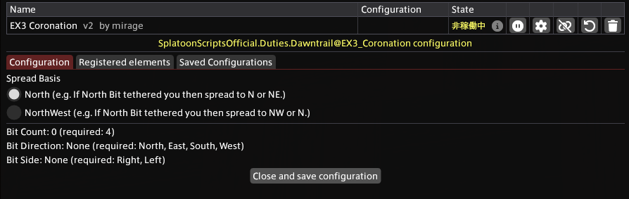

# EX3 Coronation
## About
This script guides Coronation in Sphene’s Burden. Based on your configuration, it shows spread positions.

## Import URL
Open the URL, copy the content, and then click “Install from Clipboard” in Splatoon.

```
https://raw.githubusercontent.com/exatrines/SplatoonWorkspace/refs/heads/main/Resources/EX3_Coronation.cs
```

## Configuration



### Spread basis

To bait the northern bit northwest, select “NorthWest”; to bait it northeast, select “North”.

See the raid plans below:

- [RaidPlan #1 — North](https://raidplan.io/plan/pdekw9pr5hqdpbpg#1)
- [RaidPlan #2 — NorthWest](https://raidplan.io/plan/pdekw9pr5hqdpbpg#2)

For the common Japanese **Game8** macro strat, choose **North**.
