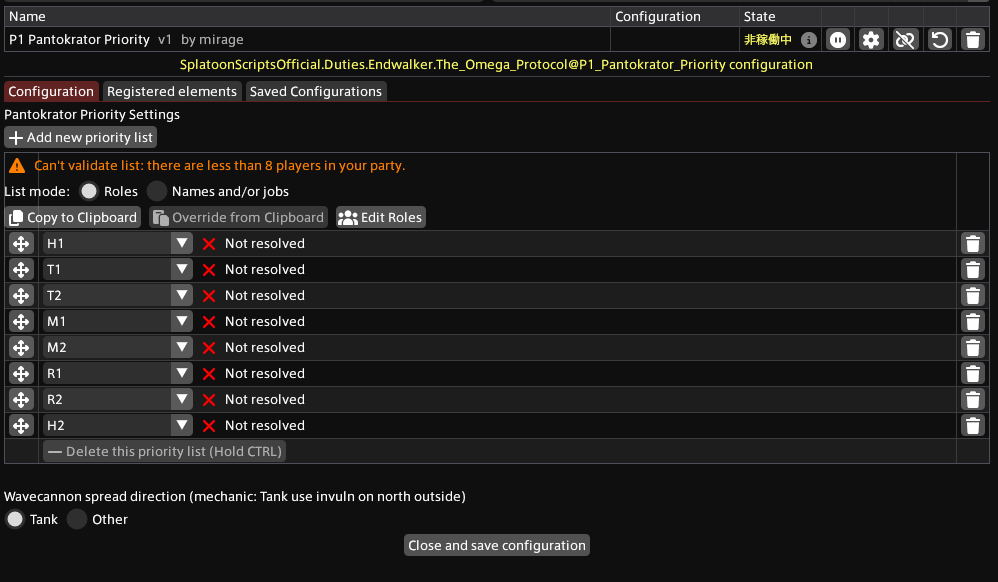

# P1 Pantokrator Priority
## About
This script guides the Pantokrator based on priority. It displays the following:

- Grouping based on priority
- Navigation to AoE positions and damage-splitting positions based on target debuffs
- Navigation to spread positions for the Wave Cannon

## Import URL

```
https://raw.githubusercontent.com/PunishXIV/Splatoon/refs/heads/main/SplatoonScripts/Duties/Endwalker/The%20Omega%20Protocol/P1_Pantokrator_Priority.cs
```

## Configuration



### Priority settings
Players are assigned to one of two groups (High or Low) based on the target debuffs applied to them and the Priority settings.

### Wave Cannon Spread Direction
The spread for this wave cannon is based on the tank becoming invulnerable in the north.
Settings must be adjusted for each your role.
