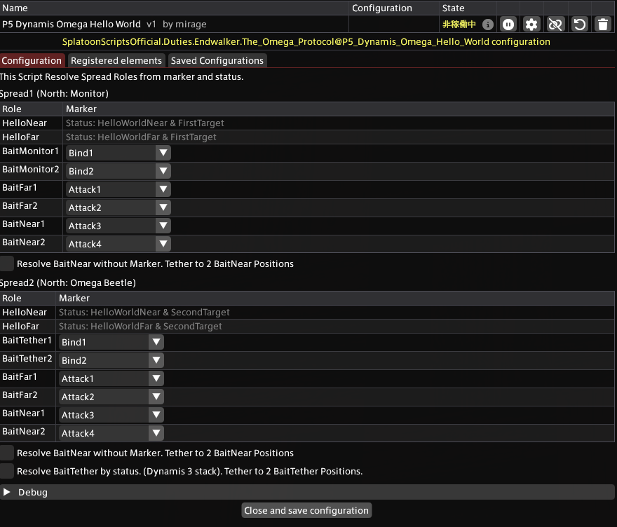

# P5 Dynamis Omega Hello World
## About
This script guides Hello World spreads using debuffs and head markers. **Must Head Marking** for it to work.

## Import URL

```
https://raw.githubusercontent.com/PunishXIV/Splatoon/refs/heads/main/SplatoonScripts/Duties/Endwalker/The%20Omega%20Protocol/P5_Dynamis_Omega_Hello_World.cs
```

## Configuration



Assign markers and roles for **Spread1** and **Spread2** respectively.

### Resolve BaitNear
Near bait uses the two players not assigned to any role in the table, instead of markers. When enabled, BaitNear1 and BaitNear2 are hidden and tethers appear at both bait positions.

### Resolve BaitTether
Omega tether bait uses the two players whose Dynamis count is 3, instead of markers. When enabled, BaitTether1 and BaitTether2 are hidden and tethers appear at both tether bait positions.

## Element Settings
Please modify the element settings as needed. For the default display positions of each element, please refer to the following RaidPlan.

- [RaidPlan](https://raidplan.io/plan/fbxgrh8z7z6x8kvu)