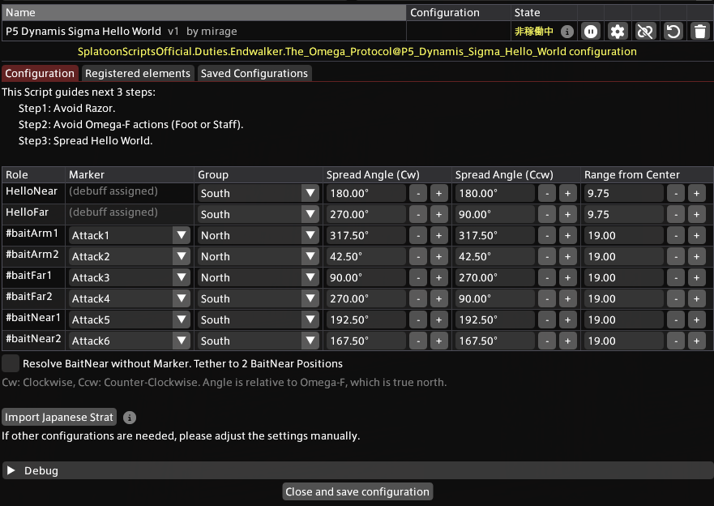

# P5 Dynamis Sigma Hello World
## About
This script guides Hello World (Sigma). **Must Head Marking** for it to work.

- Spread direction by group
- Avoid Rotation Beam
- Avoid OmegaF Action (foot or sword)
- Final Spread by Role

## Import URL

```
https://raw.githubusercontent.com/PunishXIV/Splatoon/refs/heads/main/SplatoonScripts/Duties/Endwalker/The%20Omega%20Protocol/P5_Dynamis_Sigma_Hello_World.cs
```

## Configuration



### Spread Settings
Configure which group the marker and debuff operators are assigned to, and where they will ultimately be positioned.

- Group: Starting Position
- Spread Angle: The angle of the final spread position, with the Omega F's position relative to the center of the field set to 0 degrees
- Range from Center: The distance from the center to the final spread position (the field perimeter is 20)

Cw: When the rear unit rotates clockwise; Ccw: When it rotates counterclockwise

Waining: Because of how the mechanic, you cannot reposition by editing elements; use the configuration table instead.

### Resolve BaitNear
Near bait is resolved using the two players not assigned to any role in the table, instead of relying on markers. When enabled, the BaitNear1 and Bait2 options are hidden and tethers appear at both bait positions. 

If your group uses an `/mk attack <me>` macro per player, Attack 5 and 6 may not apply; enabling this option is recommended.

## Sample configuration
For Lilydoll macros strategy, press **Import Japanese Strat**.

- RaidPlan: https://raidplan.io/plan/u98293e225836jcy
- Macro: https://jp.finalfantasyxiv.com/lodestone/character/34120564/blog/5178791/

North Group:
- `Attack1`: BaitArm (Go NorthWest)
- `Attack2`: BaitArm (Go NorthEast)
- `Attack3`: BaitFar (Far from HelloFar)

South Group:
- `HelloNear`
- `HelloFar`
- `Attack4`: BaitFar (Near from HelloFar)
- `Remaining`: BaitNear
