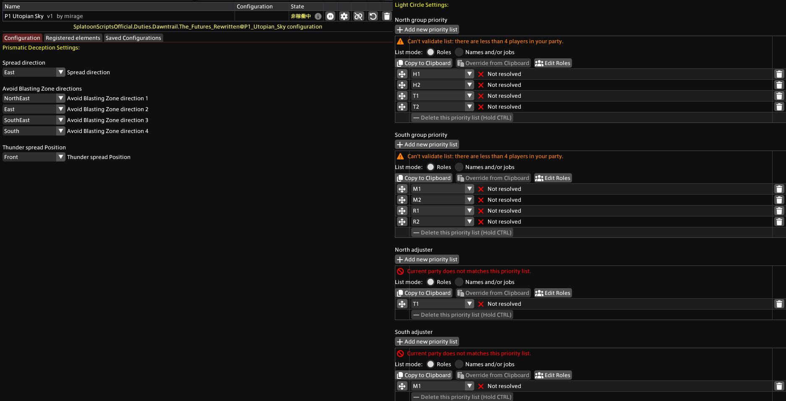
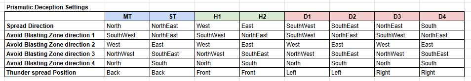

# P1 Utopian Sky
## About
P1 楽園絶技のスクリプトです。楽園絶技中の以下の2ギミックをガイドします。

- プリズマチックインビジブル
    - 8方向散開の立ち位置
    - 頭割り（炎） or 散開（雷）時の立ち位置
- 光輪
    - 優先度とデバフに基づく頭割りのグループ分けと集合位置

サイクロニックブレイク（反復横跳び）はこのスクリプトでは対応していません。[P1 Cyclonic Break](https://raw.githubusercontent.com/PunishXIV/Splatoon/refs/heads/main/SplatoonScripts/Duties/Dawntrail/The%20Futures%20Rewritten/P1%20Cyclonic%20Break.cs)を使用してください。

## Import URL
```
https://raw.githubusercontent.com/PunishXIV/Splatoon/refs/heads/main/SplatoonScripts/Duties/Dawntrail/The%20Futures%20Rewritten/P1_Utopian_Sky.cs
```

## Configuration


プリズマチックインビジブル（Prismatic Deception）と光輪（Light Circle）のそれぞれに設定が必要です。

### Prismatic Deception Settings > Spread direction
8方向散開の方角を設定してください。

### Prismatic Deception Settings > Avoid Blasting Zone directions
不可視の直線範囲の安置候補を設定してください。

### Prismatic Deception Settings > Thunder spread Position
散開（雷）の場合のグループ内の立ち位置を設定してください。

### Light Circle Settings > North group priority
北側に集合する4名を設定してください。

### Light Circle Settings > South group priority
南に集合する4名を設定してください。

### North Adjuster
北側グループの4名の内、調整役を1名設定してください。

### South Adjuster
南側グループの4名の内、調整役を1名設定してください。

## Sample Configuration for JP
LilyDollマクロの場合は以下の設定を取り込み、自分のロールを選択してください。

```
{"TargetScriptName":"SplatoonScriptsOfficial.Duties.Dawntrail.The_Futures_Rewritten@P1_Utopian_Sky","ConfigurationName":"絶エデン_D4","Configuration":"G9oHYKwK7DbaK7tC/dlXTKMKQ1wq7L3X7m+DiHT1tdyW+mUCx8EGkZlsdpJDwm9aHotFpxq6/O9v/Tx8rGETYUDntq60UWCBvJc12UYScYBQ/+/259tmc+D67heazqU+4ujABl1u+7t/m789slFCexBrDEoUps26s3LhSXuLXBsoO9N5O8geY9sdkrR3mM934bDIRoUCrahg2/ANCwdcglh8CdCyBLY6wdY6NEbELmlBKvLgkv3PgQRgL6Y6Am7G0Ouk+ZPn59NJX8BwFCmw9EzTuS9UD5O0va3RE4tQe3cBfYGI6wJ+viDRZ2mIDSvrT5/+98sTjPN8NXhnnNUniHDjHQ==","Overrides":null}
{"TargetScriptName":"SplatoonScriptsOfficial.Duties.Dawntrail.The_Futures_Rewritten@P1_Utopian_Sky","ConfigurationName":"絶エデン_D3","Configuration":"G9oHYKyKdwHRCbh89NGkUsnOYq0wt/eudn8bRKSrr6qb8tUXb3uCJigc/oqciyVgBsWiUw1d/tdps7iswSC+n1qpiQRkN9aokYQ4gNCu2s296RTMzn2h6Vy6I6SjHRvozPje64/x2SOzS2gLMpeiRGGaZBPHV+ZaIZnhXqH1HG7TQfZo04Zc48YeOZ7Zh0U2ChRoQQVbh3dYWOAcxOJDgJYhMNXpt1WUdQzYJS1IBWofsv8pkKDZi6n2aDdj2Ouk4yfPz6cTvoDhKFIg6Z6qQ0b1MEnb2eg8sahr7xbAFxi4T+DnCwQfZhQ2rGS79+l/PzPBOA9Yg/dirT7BgAvn","Overrides":null}
{"TargetScriptName":"SplatoonScriptsOfficial.Duties.Dawntrail.The_Futures_Rewritten@P1_Utopian_Sky","ConfigurationName":"絶エデン_D2","Configuration":"G9oHYKwK7DbaK7tC/dlXTKMKQ1wq7L3X7m+DiHT1tdyW+mUC9wcbRmey2UkOCb9peSwWnWro8r9Om8VlDWYiGpH3Uys1ClhAdmP9CuERHyCUbjdncw0d+vXXIAkDHu3WGRt0ha/v/n389shGCZ2CqJqUyE2bdbAKN+1bXitTXulqLSN6jMfukEl7h8d4Jw6L9qiQoxUlbBu+YeGASxCLLwFalsBWJ9hah3qL7EtakIo8uGT7x0ACsBdT7QE3Y6h10vjJs/PppC+gO4oUWLqn6VwT2cMkbW9r9MAi1N5dQF8g4roCO19g9FlqYsHK9qdO//sZAcZ5eTl4Z5zVJ4hw4R0=","Overrides":null}
{"TargetScriptName":"SplatoonScriptsOfficial.Duties.Dawntrail.The_Futures_Rewritten@P1_Utopian_Sky","ConfigurationName":"絶エデン_D1","Configuration":"G9oHYKyKdwHRCbh89NGkUsnOYq0wt/eudn8bRKSrr6qb8tUXb3uCJigc/oqciyVgBsWiUw1d/tdps7iswSC+n1qpiQRkN1bqFZIjPkAo3W7uTafg7NwXmubSHSEdnbGBzozvvf4Ynz0yu4ROQdJSlChMk2zi+MpTZYb7CK0Hb6omske7bdjQuLFHjmf2YREWKNCCCrYO77CwwDmIxYcALUNgqtNvqyjrGLBLWpAK1D5l/7tAgmYvptqj3Yxhr5PGT56fTyd8AcNRpEDSNVWHjOphkraz2XliUdfeXQBfYOC+Aj9fIPgso7hhJdu9T//7mQnGeXk1eGes1ScYcOIc","Overrides":null}
{"TargetScriptName":"SplatoonScriptsOfficial.Duties.Dawntrail.The_Futures_Rewritten@P1_Utopian_Sky","ConfigurationName":"絶エデン_BH","Configuration":"G9kHYCwLeMNo7imJ8Gy/PcV0VXNzExMEagWyvXewAQfGaTkON4hIV1/LW+qfBff3NqKSP9lPsFHQIkNJUIpFpxq6/K/TZnFZg5kgvZ9aqYkEZDeWflXkjA8QSreb+1RJ6NtvYUxHj0V29Iz3QF/eGX/Fb4+sU4I4UctJh6K0yAFqtzJTzXAeATK3naiM5NGfupakLZexZxsW2SilOEuq1yb5hIX1LYRYfAfQMgWWOp1aRZVjyC5pQSpQ95T974IEvV5M1aPbjGGrk/gnz8+nA74A4ShCIOmeuhooHiZpu5u9JxY17d0F8AUEzivw8wUKn0UUN6y0u03/+3kTjOPyavDOWKtPIODCPQ==","Overrides":null}
{"TargetScriptName":"SplatoonScriptsOfficial.Duties.Dawntrail.The_Futures_Rewritten@P1_Utopian_Sky","ConfigurationName":"絶エデン_PH","Configuration":"G9oHYKyKdwHRCbh89NGkUsnOYq0wt/eudn8bRKSrr6qb8tUXb3uCJigc/oqciyVgBsWiUw1d/v+fej5+1mAQ78uctEQC8n7StblCJS4gjG09fc7Bhnr6NUjEgKOxjs7YQGfG915/jM8e2VVCpyCttQiRmTa5xDG61PHSgutalWwHzYXgPca22U46e+R4Zh0WjQoZWlHAtuEdFg64BDZ/CJCyGLY4/baKuo6RdUkKXEb9U9V/CDgo9hK6PcrNBHKd0n7y9Hw64QtojiYZKfc0HXZEj1Ckvc25OxZV7d0F8AUG6SvQ8wWCzzLyhJVtd57+9zMdTPLyYvDOOKtPMODCOw==","Overrides":null}
{"TargetScriptName":"SplatoonScriptsOfficial.Duties.Dawntrail.The_Futures_Rewritten@P1_Utopian_Sky","ConfigurationName":"絶エデン_ST","Configuration":"G9kHYCwLbNNhdB/dhS/2x6Oho4ajQaGlwt47bMCBSZK+43CDiHT1tbyl/llwf28jKvmT/QQbBS0ylASlWHSqocv/Om0WP2swE6T3Uys1kYDsxsqVKnLGBwil2819qiTat9/CmA7HIjt6xnvQ13fGX/HbI+eUIE5kJcmwlw4tCSQ13jLxCFAP2U7UgeAxnxp8c/ZciT3bsFhHLflZU752yScs7G8l2PI7gJTNcMT51CqaHGN6WQpciYaXan8XOOj1Eroe3WYCpU4ZP3l2Ph3wBXBHExIp97TVieQRirS/NXpgcdPeXQBfQCBegZ0vUPgsolyw8k6Z/vfzBhjh8nLwztirTyDgwj8=","Overrides":null}
{"TargetScriptName":"SplatoonScriptsOfficial.Duties.Dawntrail.The_Futures_Rewritten@P1_Utopian_Sky","ConfigurationName":"絶エデン_MT","Configuration":"G9gHYKwOeHNXKDqBq08+LTrqTqmw9167vw0i0tXXclvqlwncH4zMTDY7ySHhNy2PxaJTDV3+12mzuGEMZkIxfD+1UqOABWQ3Vq7z0SEfIJRuN2db7gSr8bfQ3vzUIaShMzboCt/f/fv87JHzlyBOlJMKOenweiRux5vVQ5H+lnkxEitix7zpHlE6ODzmu7qwaI4auVlTunbhDRaWtwKx+AigZQscdWpa69Gg2LykBanA40O2fwgkaPVimiOazRgqnbT95Nn5dOIL6I4qBZauaTv3jtxhkra/MXlgUc/eXYAvELiuwM4XGD5LJBasvD9V+t+vCDDOy8vBO2OtPkHAiX8=","Overrides":null}
```

設定内容は以下となります。

### Prismatic Deception Settings
ロールごとに設定が異なります。次の表を参考にしてください。



### Light Circle Settings
- North Group Priority: `H1 > H2 > T1 > T2`
- South Group Priority: `M1 > M2 > R1 > R2`
- North Adjuster: `T1`
- South Adjuster: `M1`
