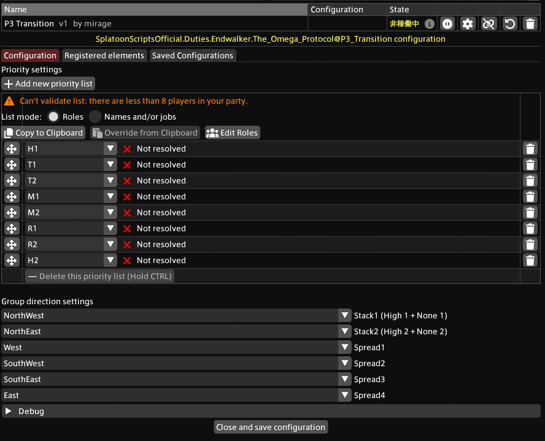

# P3 Transition
## 概要
コロッサスブローをガイドするスクリプトです。以下が表示されます。

- グループに応じた散開
- 波動パルス（ドーナツ）AOE の回避

注意: 本スクリプトはドーナツAOEを表示しません。レイアウトを別途導入してください。

## インポート URL

```
https://raw.githubusercontent.com/PunishXIV/Splatoon/refs/heads/main/SplatoonScripts/Duties/Endwalker/The%20Omega%20Protocol/P3_Transition.cs
```

## 設定



### Priority 設定
プレイヤーに付与されるデバフと Priority 設定に基づき、6 グループのいずれかに割り当てます。

### Group direction 設定
各グループがどの方角で処理するかを設定できます。

## 設定例（日本式）
りりどマクロの例:

- priority: `H1 > T1 > T2 > M1 > M2 > R1 > R2 > H2`
- direction: 上から `NW, NE, W, SW, SE, E`
