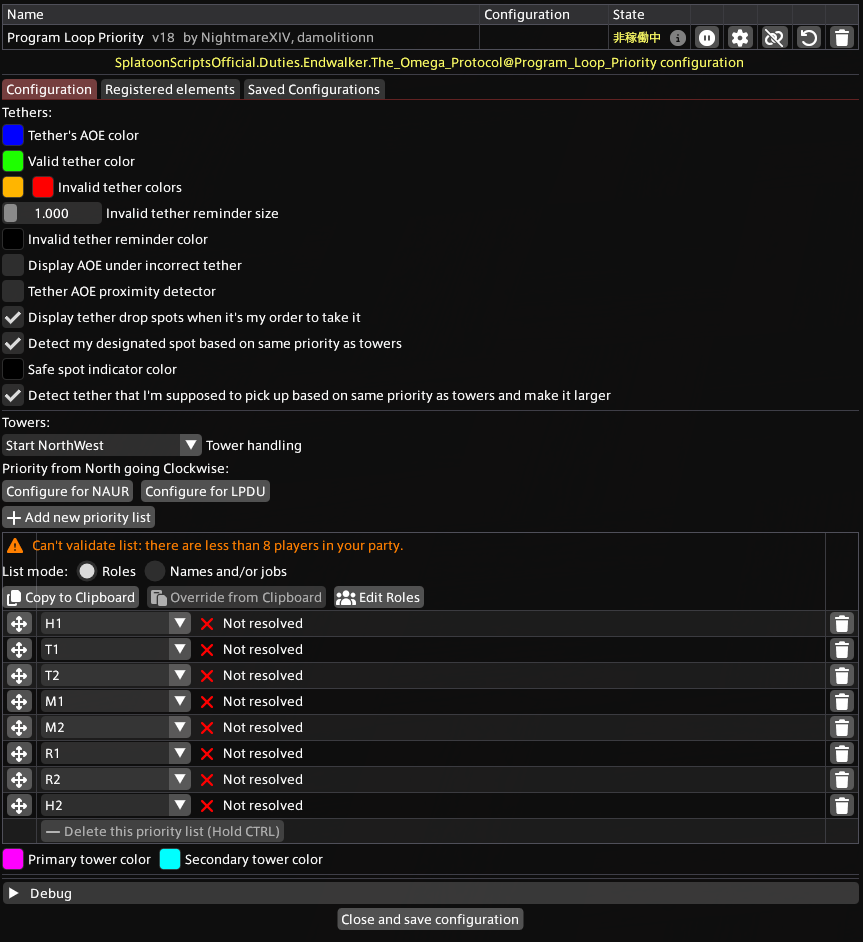
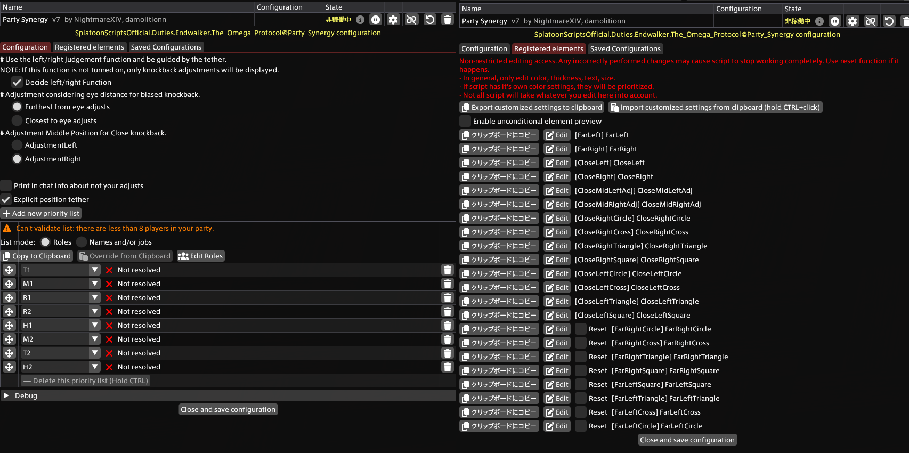
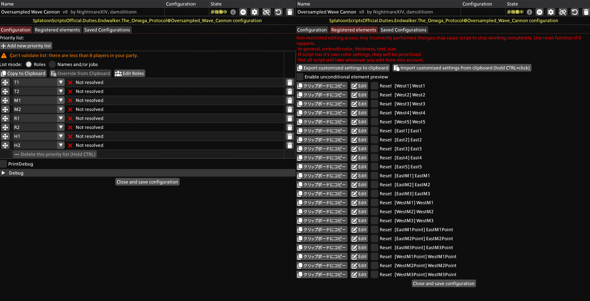
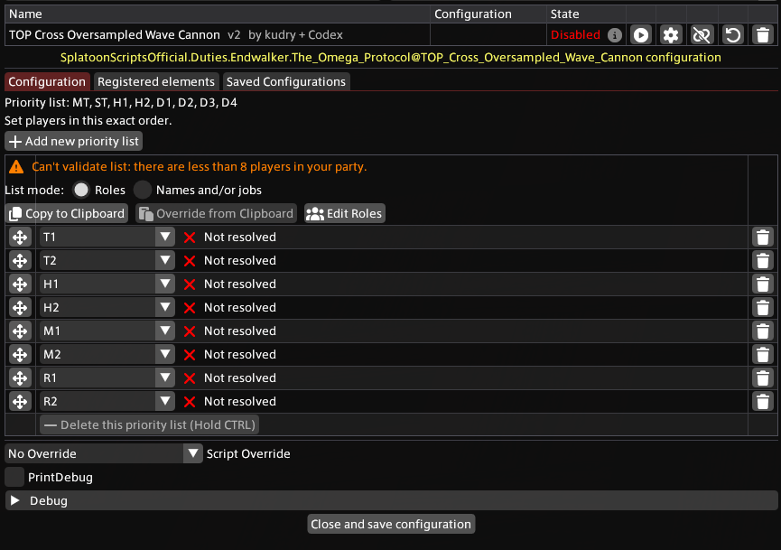
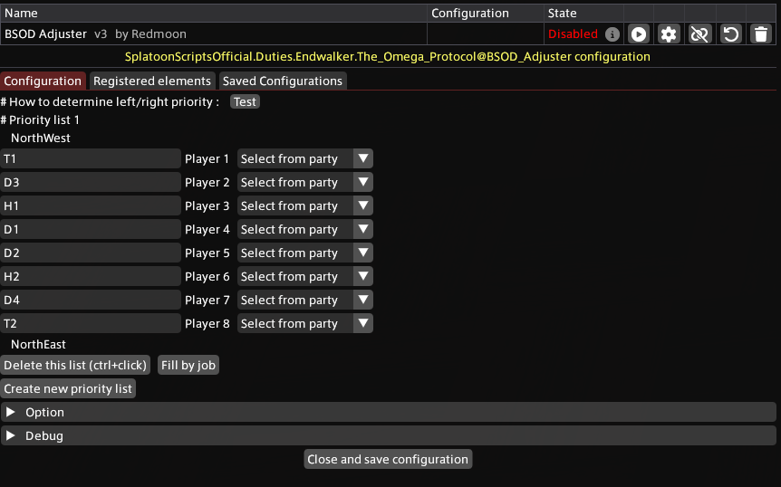
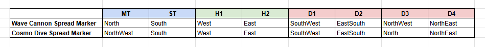
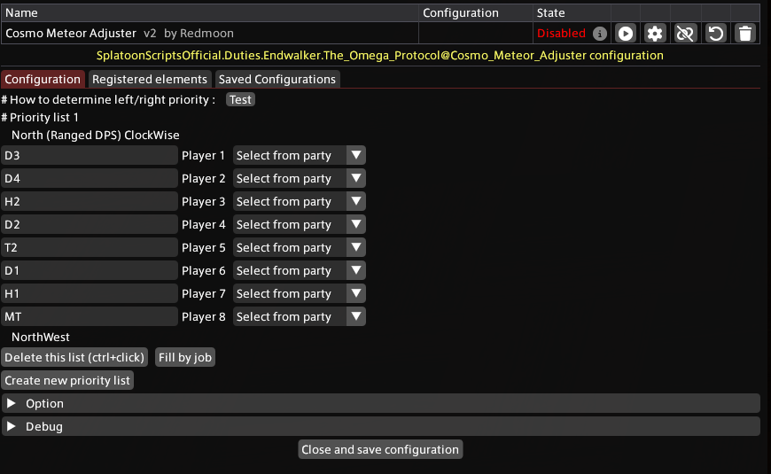

# 絶オメガ検証戦
絶オメガ検証戦におけるレイアウトとスクリプトのまとめです。ほとんどのスクリプトにおいて優先度設定が必要なため、PriorityEditor ( `/splatoon p` ) の設定は必ず行ってください。

日本で多く採用されている [基本りりど《HTDH/縦2列,南誘導/検知アスト/デルタハムカツ/シグマりょんめ塔wingwan式/最終ぬけまる》](https://jp.finalfantasyxiv.com/lodestone/character/34120564/blog/5178791/) を基準としています。ただし、固定などで採用されているP3検知式波動砲の十字式や、P5シグマの塔マクロ押さない式についても記載しています。

また、攻略をスムーズに進めるために自動マーキングプラグインである「Lemegeton」と、P1P3のオメガのサイズを小さくするプラグインである「Chibi Omega」の導入も推奨しています。

## レイアウト

以下のリンク先のレイアウトをすべてコピーして取り込んでください。

[レイアウトまとめ](https://raw.githubusercontent.com/exatrines/SplatoonWorkspace/refs/heads/main/Resources/top_layout.txt)

一部のレイアウトはスクリプトの導入で不要になる可能性があります。

<details markdown="block">
<summary>詳細</summary>

### 基本レイアウト
[光のツーラー様のブログ](https://tooleroflight.blog.jp/archives/24065980.html) 記載のレイアウトを基本としています。

### 追加レイアウト（公式）

#### P5 デルタ 最終散開位置
[Hello world final positions](https://github.com/PunishXIV/Splatoon/blob/main/Presets/Endwalker/Duties/Ultimate%20-%20The%20Omega%20Protocol/Phase%205%20-%20Dynamis%20Omega%20-%201.%20Delta.md#hello-world-final-positions)

リリドであれば [International] Japanese strat で問題ありません。

#### P5 シグマ 最終散開位置
[Hello world final positions](https://github.com/PunishXIV/Splatoon/blob/main/Presets/Endwalker/Duties/Ultimate%20-%20The%20Omega%20Protocol/Phase%205%20-%20Dynamis%20Omega%20-%202.%20Sigma.md#hello-world-final-positions)

リリドであれば [International] Japanese strat で問題ありません。

#### P5 オメガ 最終散開位置
[Hello world final positions](https://github.com/PunishXIV/Splatoon/blob/main/Presets/Endwalker/Duties/Ultimate%20-%20The%20Omega%20Protocol/Phase%205%20-%20Dynamis%20Omega%20-%203.%20Omega.md#hello-world-final-positions)

リリドであれば [International] [Untested] Sausage strat を導入しを修正する必要があります。
</details>

## スクリプト
### P1 サークルプログラム
デバフと優先度をもとにどの塔を踏むか、テザーを取ってどの方角に行くかがガイドされます。

#### URL
```
https://github.com/PunishXIV/Splatoon/raw/refs/heads/main/SplatoonScripts/Duties/Endwalker/The%20Omega%20Protocol/Program%20Loop%20Priority.cs
```
#### Configuration


### P1 パンクラ
直線頭割りとAOEの範囲が表示されます。優先度によるグループ分けは行われないので注意が必要です。

#### URL
```
https://github.com/PunishXIV/Splatoon/raw/main/SplatoonScripts/Duties/Endwalker/The%20Omega%20Protocol/Pantokrator.cs
```
#### Configuration
デフォルトから設定を変更する必要はありませんが、視認性を向上させるために色の調整をすることができます。

### P1 パンクラ無敵タイミングアナウンス
無敵を押すタイミングが頭上に表示されます。

#### URL
```
https://raw.githubusercontent.com/PunishXIV/Splatoon/refs/heads/main/SplatoonScripts/Duties/Endwalker/The%20Omega%20Protocol/Pantokrator%20invincible%20Reminder.cs
```
#### Configuration
設定不要

### P2 連携プログラム
優先度とプレステマーカーとグリッチデバフをもとに散開先とノクバ前の集合場所がガイドされます。

#### URL
```
https://raw.githubusercontent.com/PunishXIV/Splatoon/main/SplatoonScripts/Duties/Endwalker/The%20Omega%20Protocol/Party%20Synergy.cs
```
#### Configuration


以下コードをコピーしてスクリプトの「Registerd Elements」タブの「Import customized settings from clipboard」から取り込み（CTRL+Click）
```
{"Elements":{"FarRightCircle":{"Name":"FarRightCircle","type":1,"Enabled":false,"offX":-10.94,"offY":60.14,"offZ":-0.2,"radius":1.0,"color":4278190335,"Filled":true,"fillIntensity":null,"overlayBGColor":0,"overlayTextColor":4278190335,"overlayVOffset":0.0,"overlayFScale":2.0,"overlayPlaceholders":false,"thicc":5.0,"overlayText":"","refActorTargetingYou":0,"refActorNPCNameID":7640,"refActorNamePlateIconID":0,"refActorComparisonAnd":false,"refActorRequireCast":false,"refActorCastReverse":false,"refActorUseCastTime":false,"refActorCastTimeMin":0.0,"refActorCastTimeMax":0.0,"refActorUseOvercast":false,"refTargetYou":false,"refActorRequireBuff":false,"refActorRequireAllBuffs":false,"refActorRequireBuffsInvert":false,"refActorUseBuffTime":false,"refActorUseBuffParam":false,"refActorBuffTimeMin":0.0,"refActorBuffTimeMax":0.0,"refActorObjectLife":false,"TargetAlteration":0,"refActorComparisonType":6,"refActorType":0,"includeHitbox":false,"includeOwnHitbox":false,"includeRotation":true,"onlyTargetable":false,"onlyUnTargetable":false,"onlyVisible":false,"tether":false,"ExtraTetherLength":0.0,"LineEndA":0,"LineEndB":0,"AdditionalRotation":0.0,"LineAddHitboxLengthX":false,"LineAddHitboxLengthY":false,"LineAddHitboxLengthZ":false,"LineAddHitboxLengthXA":false,"LineAddHitboxLengthYA":false,"LineAddHitboxLengthZA":false,"LineAddPlayerHitboxLengthX":false,"LineAddPlayerHitboxLengthY":false,"LineAddPlayerHitboxLengthZ":false,"LineAddPlayerHitboxLengthXA":false,"LineAddPlayerHitboxLengthYA":false,"LineAddPlayerHitboxLengthZA":false,"FaceMe":false,"LimitDistance":false,"LimitDistanceInvert":false,"DistanceSourceX":0.0,"DistanceSourceY":0.0,"DistanceSourceZ":0.0,"DistanceMin":0.0,"DistanceMax":0.0,"UseDistanceSourcePlaceholder":false,"LimitRotation":false,"refActorTether":false,"refActorTetherTimeMin":0.0,"refActorTetherTimeMax":0.0,"refActorTetherParam1":null,"refActorTetherParam2":null,"refActorTetherParam3":null,"refActorIsTetherSource":null,"refActorIsTetherInvert":false,"refActorIsTetherLive":false,"refActorUseTransformation":false,"mechanicType":0,"refMark":false,"refMarkID":0,"faceplayer":"<1>","FaceInvert":false,"FillStep":0.5,"LegacyFill":false,"RenderEngineKind":0,"Conditional":false,"RotationOverride":false,"IsCapturing":false,"Nodraw":false,"UseHitboxRadius":false,"MapEffectInvert":false,"MapEffectAnd":false,"UseCastRotation":false,"UseCastPosition":false,"UseCastTarget":false,"IsDead":null,"Enumeration":0,"AnimationInverted":false},"FarRightCross":{"Name":"FarRightCross","type":1,"Enabled":false,"offX":-18.24,"offY":49.78,"offZ":0.0,"radius":1.0,"color":4294967040,"Filled":true,"fillIntensity":null,"overlayBGColor":0,"overlayTextColor":4294967040,"overlayVOffset":0.0,"overlayFScale":2.0,"overlayPlaceholders":false,"thicc":5.0,"overlayText":"","refActorTargetingYou":0,"refActorNPCNameID":7640,"refActorNamePlateIconID":0,"refActorComparisonAnd":false,"refActorRequireCast":false,"refActorCastReverse":false,"refActorUseCastTime":false,"refActorCastTimeMin":0.0,"refActorCastTimeMax":0.0,"refActorUseOvercast":false,"refTargetYou":false,"refActorRequireBuff":false,"refActorRequireAllBuffs":false,"refActorRequireBuffsInvert":false,"refActorUseBuffTime":false,"refActorUseBuffParam":false,"refActorBuffTimeMin":0.0,"refActorBuffTimeMax":0.0,"refActorObjectLife":false,"TargetAlteration":0,"refActorComparisonType":6,"refActorType":0,"includeHitbox":false,"includeOwnHitbox":false,"includeRotation":true,"onlyTargetable":false,"onlyUnTargetable":false,"onlyVisible":false,"tether":false,"ExtraTetherLength":0.0,"LineEndA":0,"LineEndB":0,"AdditionalRotation":0.0,"LineAddHitboxLengthX":false,"LineAddHitboxLengthY":false,"LineAddHitboxLengthZ":false,"LineAddHitboxLengthXA":false,"LineAddHitboxLengthYA":false,"LineAddHitboxLengthZA":false,"LineAddPlayerHitboxLengthX":false,"LineAddPlayerHitboxLengthY":false,"LineAddPlayerHitboxLengthZ":false,"LineAddPlayerHitboxLengthXA":false,"LineAddPlayerHitboxLengthYA":false,"LineAddPlayerHitboxLengthZA":false,"FaceMe":false,"LimitDistance":false,"LimitDistanceInvert":false,"DistanceSourceX":0.0,"DistanceSourceY":0.0,"DistanceSourceZ":0.0,"DistanceMin":0.0,"DistanceMax":0.0,"UseDistanceSourcePlaceholder":false,"LimitRotation":false,"refActorTether":false,"refActorTetherTimeMin":0.0,"refActorTetherTimeMax":0.0,"refActorTetherParam1":null,"refActorTetherParam2":null,"refActorTetherParam3":null,"refActorIsTetherSource":null,"refActorIsTetherInvert":false,"refActorIsTetherLive":false,"refActorUseTransformation":false,"mechanicType":0,"refMark":false,"refMarkID":0,"faceplayer":"<1>","FaceInvert":false,"FillStep":0.5,"LegacyFill":false,"RenderEngineKind":0,"Conditional":false,"RotationOverride":false,"IsCapturing":false,"Nodraw":false,"UseHitboxRadius":false,"MapEffectInvert":false,"MapEffectAnd":false,"UseCastRotation":false,"UseCastPosition":false,"UseCastTarget":false,"IsDead":null,"Enumeration":0,"AnimationInverted":false},"FarRightTriangle":{"Name":"FarRightTriangle","type":1,"Enabled":false,"offX":-17.26,"offY":37.96,"offZ":0.0,"radius":1.0,"color":4278255360,"Filled":true,"fillIntensity":null,"overlayBGColor":0,"overlayTextColor":4278255360,"overlayVOffset":0.0,"overlayFScale":2.0,"overlayPlaceholders":false,"thicc":5.0,"overlayText":"","refActorTargetingYou":0,"refActorNPCNameID":7640,"refActorNamePlateIconID":0,"refActorComparisonAnd":false,"refActorRequireCast":false,"refActorCastReverse":false,"refActorUseCastTime":false,"refActorCastTimeMin":0.0,"refActorCastTimeMax":0.0,"refActorUseOvercast":false,"refTargetYou":false,"refActorRequireBuff":false,"refActorRequireAllBuffs":false,"refActorRequireBuffsInvert":false,"refActorUseBuffTime":false,"refActorUseBuffParam":false,"refActorBuffTimeMin":0.0,"refActorBuffTimeMax":0.0,"refActorObjectLife":false,"TargetAlteration":0,"refActorComparisonType":6,"refActorType":0,"includeHitbox":false,"includeOwnHitbox":false,"includeRotation":true,"onlyTargetable":false,"onlyUnTargetable":false,"onlyVisible":false,"tether":false,"ExtraTetherLength":0.0,"LineEndA":0,"LineEndB":0,"AdditionalRotation":0.0,"LineAddHitboxLengthX":false,"LineAddHitboxLengthY":false,"LineAddHitboxLengthZ":false,"LineAddHitboxLengthXA":false,"LineAddHitboxLengthYA":false,"LineAddHitboxLengthZA":false,"LineAddPlayerHitboxLengthX":false,"LineAddPlayerHitboxLengthY":false,"LineAddPlayerHitboxLengthZ":false,"LineAddPlayerHitboxLengthXA":false,"LineAddPlayerHitboxLengthYA":false,"LineAddPlayerHitboxLengthZA":false,"FaceMe":false,"LimitDistance":false,"LimitDistanceInvert":false,"DistanceSourceX":0.0,"DistanceSourceY":0.0,"DistanceSourceZ":0.0,"DistanceMin":0.0,"DistanceMax":0.0,"UseDistanceSourcePlaceholder":false,"LimitRotation":false,"refActorTether":false,"refActorTetherTimeMin":0.0,"refActorTetherTimeMax":0.0,"refActorTetherParam1":null,"refActorTetherParam2":null,"refActorTetherParam3":null,"refActorIsTetherSource":null,"refActorIsTetherInvert":false,"refActorIsTetherLive":false,"refActorUseTransformation":false,"mechanicType":0,"refMark":false,"refMarkID":0,"faceplayer":"<1>","FaceInvert":false,"FillStep":0.5,"LegacyFill":false,"RenderEngineKind":0,"Conditional":false,"RotationOverride":false,"IsCapturing":false,"Nodraw":false,"UseHitboxRadius":false,"MapEffectInvert":false,"MapEffectAnd":false,"UseCastRotation":false,"UseCastPosition":false,"UseCastTarget":false,"IsDead":null,"Enumeration":0,"AnimationInverted":false},"FarRightSquare":{"Name":"FarRightSquare","type":1,"Enabled":false,"offX":-11.0,"offY":30.04,"offZ":0.0,"radius":1.0,"color":4294902015,"Filled":true,"fillIntensity":null,"overlayBGColor":0,"overlayTextColor":4294902015,"overlayVOffset":0.0,"overlayFScale":2.0,"overlayPlaceholders":false,"thicc":5.0,"overlayText":"","refActorTargetingYou":0,"refActorNPCNameID":7640,"refActorNamePlateIconID":0,"refActorComparisonAnd":false,"refActorRequireCast":false,"refActorCastReverse":false,"refActorUseCastTime":false,"refActorCastTimeMin":0.0,"refActorCastTimeMax":0.0,"refActorUseOvercast":false,"refTargetYou":false,"refActorRequireBuff":false,"refActorRequireAllBuffs":false,"refActorRequireBuffsInvert":false,"refActorUseBuffTime":false,"refActorUseBuffParam":false,"refActorBuffTimeMin":0.0,"refActorBuffTimeMax":0.0,"refActorObjectLife":false,"TargetAlteration":0,"refActorComparisonType":6,"refActorType":0,"includeHitbox":false,"includeOwnHitbox":false,"includeRotation":true,"onlyTargetable":false,"onlyUnTargetable":false,"onlyVisible":false,"tether":false,"ExtraTetherLength":0.0,"LineEndA":0,"LineEndB":0,"AdditionalRotation":0.0,"LineAddHitboxLengthX":false,"LineAddHitboxLengthY":false,"LineAddHitboxLengthZ":false,"LineAddHitboxLengthXA":false,"LineAddHitboxLengthYA":false,"LineAddHitboxLengthZA":false,"LineAddPlayerHitboxLengthX":false,"LineAddPlayerHitboxLengthY":false,"LineAddPlayerHitboxLengthZ":false,"LineAddPlayerHitboxLengthXA":false,"LineAddPlayerHitboxLengthYA":false,"LineAddPlayerHitboxLengthZA":false,"FaceMe":false,"LimitDistance":false,"LimitDistanceInvert":false,"DistanceSourceX":0.0,"DistanceSourceY":0.0,"DistanceSourceZ":0.0,"DistanceMin":0.0,"DistanceMax":0.0,"UseDistanceSourcePlaceholder":false,"LimitRotation":false,"refActorTether":false,"refActorTetherTimeMin":0.0,"refActorTetherTimeMax":0.0,"refActorTetherParam1":null,"refActorTetherParam2":null,"refActorTetherParam3":null,"refActorIsTetherSource":null,"refActorIsTetherInvert":false,"refActorIsTetherLive":false,"refActorUseTransformation":false,"mechanicType":0,"refMark":false,"refMarkID":0,"faceplayer":"<1>","FaceInvert":false,"FillStep":0.5,"LegacyFill":false,"RenderEngineKind":0,"Conditional":false,"RotationOverride":false,"IsCapturing":false,"Nodraw":false,"UseHitboxRadius":false,"MapEffectInvert":false,"MapEffectAnd":false,"UseCastRotation":false,"UseCastPosition":false,"UseCastTarget":false,"IsDead":null,"Enumeration":0,"AnimationInverted":false},"FarLeftSquare":{"Name":"FarLeftSquare","type":1,"Enabled":false,"offX":11.0,"offY":60.12,"offZ":0.0,"radius":1.0,"color":4294902015,"Filled":true,"fillIntensity":null,"overlayBGColor":0,"overlayTextColor":4294902015,"overlayVOffset":0.0,"overlayFScale":2.0,"overlayPlaceholders":false,"thicc":5.0,"overlayText":"","refActorTargetingYou":0,"refActorNPCNameID":7640,"refActorNamePlateIconID":0,"refActorComparisonAnd":false,"refActorRequireCast":false,"refActorCastReverse":false,"refActorUseCastTime":false,"refActorCastTimeMin":0.0,"refActorCastTimeMax":0.0,"refActorUseOvercast":false,"refTargetYou":false,"refActorRequireBuff":false,"refActorRequireAllBuffs":false,"refActorRequireBuffsInvert":false,"refActorUseBuffTime":false,"refActorUseBuffParam":false,"refActorBuffTimeMin":0.0,"refActorBuffTimeMax":0.0,"refActorObjectLife":false,"TargetAlteration":0,"refActorComparisonType":6,"refActorType":0,"includeHitbox":false,"includeOwnHitbox":false,"includeRotation":true,"onlyTargetable":false,"onlyUnTargetable":false,"onlyVisible":false,"tether":false,"ExtraTetherLength":0.0,"LineEndA":0,"LineEndB":0,"AdditionalRotation":0.0,"LineAddHitboxLengthX":false,"LineAddHitboxLengthY":false,"LineAddHitboxLengthZ":false,"LineAddHitboxLengthXA":false,"LineAddHitboxLengthYA":false,"LineAddHitboxLengthZA":false,"LineAddPlayerHitboxLengthX":false,"LineAddPlayerHitboxLengthY":false,"LineAddPlayerHitboxLengthZ":false,"LineAddPlayerHitboxLengthXA":false,"LineAddPlayerHitboxLengthYA":false,"LineAddPlayerHitboxLengthZA":false,"FaceMe":false,"LimitDistance":false,"LimitDistanceInvert":false,"DistanceSourceX":0.0,"DistanceSourceY":0.0,"DistanceSourceZ":0.0,"DistanceMin":0.0,"DistanceMax":0.0,"UseDistanceSourcePlaceholder":false,"LimitRotation":false,"refActorTether":false,"refActorTetherTimeMin":0.0,"refActorTetherTimeMax":0.0,"refActorTetherParam1":null,"refActorTetherParam2":null,"refActorTetherParam3":null,"refActorIsTetherSource":null,"refActorIsTetherInvert":false,"refActorIsTetherLive":false,"refActorUseTransformation":false,"mechanicType":0,"refMark":false,"refMarkID":0,"faceplayer":"<1>","FaceInvert":false,"FillStep":0.5,"LegacyFill":false,"RenderEngineKind":0,"Conditional":false,"RotationOverride":false,"IsCapturing":false,"Nodraw":false,"UseHitboxRadius":false,"MapEffectInvert":false,"MapEffectAnd":false,"UseCastRotation":false,"UseCastPosition":false,"UseCastTarget":false,"IsDead":null,"Enumeration":0,"AnimationInverted":false},"FarLeftTriangle":{"Name":"FarLeftTriangle","type":1,"Enabled":false,"offX":17.18,"offY":52.6,"offZ":0.0,"radius":1.0,"color":4278255360,"Filled":true,"fillIntensity":0.39215687,"overlayBGColor":0,"overlayTextColor":4278255360,"overlayVOffset":0.0,"overlayFScale":2.0,"overlayPlaceholders":false,"thicc":5.0,"overlayText":"","refActorTargetingYou":0,"refActorNPCNameID":7640,"refActorNamePlateIconID":0,"refActorComparisonAnd":false,"refActorRequireCast":false,"refActorCastReverse":false,"refActorUseCastTime":false,"refActorCastTimeMin":0.0,"refActorCastTimeMax":0.0,"refActorUseOvercast":false,"refTargetYou":false,"refActorRequireBuff":false,"refActorRequireAllBuffs":false,"refActorRequireBuffsInvert":false,"refActorUseBuffTime":false,"refActorUseBuffParam":false,"refActorBuffTimeMin":0.0,"refActorBuffTimeMax":0.0,"refActorObjectLife":false,"TargetAlteration":0,"refActorComparisonType":6,"refActorType":0,"includeHitbox":false,"includeOwnHitbox":false,"includeRotation":true,"onlyTargetable":false,"onlyUnTargetable":false,"onlyVisible":false,"tether":true,"ExtraTetherLength":0.0,"LineEndA":0,"LineEndB":0,"AdditionalRotation":0.0,"LineAddHitboxLengthX":false,"LineAddHitboxLengthY":false,"LineAddHitboxLengthZ":false,"LineAddHitboxLengthXA":false,"LineAddHitboxLengthYA":false,"LineAddHitboxLengthZA":false,"LineAddPlayerHitboxLengthX":false,"LineAddPlayerHitboxLengthY":false,"LineAddPlayerHitboxLengthZ":false,"LineAddPlayerHitboxLengthXA":false,"LineAddPlayerHitboxLengthYA":false,"LineAddPlayerHitboxLengthZA":false,"FaceMe":false,"LimitDistance":false,"LimitDistanceInvert":false,"DistanceSourceX":0.0,"DistanceSourceY":0.0,"DistanceSourceZ":0.0,"DistanceMin":0.0,"DistanceMax":0.0,"UseDistanceSourcePlaceholder":false,"LimitRotation":false,"refActorTether":false,"refActorTetherTimeMin":0.0,"refActorTetherTimeMax":0.0,"refActorTetherParam1":null,"refActorTetherParam2":null,"refActorTetherParam3":null,"refActorIsTetherSource":null,"refActorIsTetherInvert":false,"refActorIsTetherLive":false,"refActorUseTransformation":false,"mechanicType":0,"refMark":false,"refMarkID":0,"faceplayer":"<1>","FaceInvert":false,"FillStep":0.5,"LegacyFill":false,"RenderEngineKind":0,"Conditional":false,"RotationOverride":false,"IsCapturing":false,"Nodraw":false,"UseHitboxRadius":false,"MapEffectInvert":false,"MapEffectAnd":false,"UseCastRotation":false,"UseCastPosition":false,"UseCastTarget":false,"IsDead":null,"Enumeration":0,"AnimationInverted":false},"FarLeftCross":{"Name":"FarLeftCross","type":1,"Enabled":false,"offX":17.46,"offY":38.32,"offZ":0.0,"radius":1.0,"color":4294967040,"Filled":true,"fillIntensity":0.39215687,"overlayBGColor":0,"overlayTextColor":4294967040,"overlayVOffset":0.0,"overlayFScale":2.0,"overlayPlaceholders":false,"thicc":5.0,"overlayText":"","refActorTargetingYou":0,"refActorNPCNameID":7640,"refActorNamePlateIconID":0,"refActorComparisonAnd":false,"refActorRequireCast":false,"refActorCastReverse":false,"refActorUseCastTime":false,"refActorCastTimeMin":0.0,"refActorCastTimeMax":0.0,"refActorUseOvercast":false,"refTargetYou":false,"refActorRequireBuff":false,"refActorRequireAllBuffs":false,"refActorRequireBuffsInvert":false,"refActorUseBuffTime":false,"refActorUseBuffParam":false,"refActorBuffTimeMin":0.0,"refActorBuffTimeMax":0.0,"refActorObjectLife":false,"TargetAlteration":0,"refActorComparisonType":6,"refActorType":0,"includeHitbox":false,"includeOwnHitbox":false,"includeRotation":true,"onlyTargetable":false,"onlyUnTargetable":false,"onlyVisible":false,"tether":false,"ExtraTetherLength":0.0,"LineEndA":0,"LineEndB":0,"AdditionalRotation":0.0,"LineAddHitboxLengthX":false,"LineAddHitboxLengthY":false,"LineAddHitboxLengthZ":false,"LineAddHitboxLengthXA":false,"LineAddHitboxLengthYA":false,"LineAddHitboxLengthZA":false,"LineAddPlayerHitboxLengthX":false,"LineAddPlayerHitboxLengthY":false,"LineAddPlayerHitboxLengthZ":false,"LineAddPlayerHitboxLengthXA":false,"LineAddPlayerHitboxLengthYA":false,"LineAddPlayerHitboxLengthZA":false,"FaceMe":false,"LimitDistance":false,"LimitDistanceInvert":false,"DistanceSourceX":0.0,"DistanceSourceY":0.0,"DistanceSourceZ":0.0,"DistanceMin":0.0,"DistanceMax":0.0,"UseDistanceSourcePlaceholder":false,"LimitRotation":false,"refActorTether":false,"refActorTetherTimeMin":0.0,"refActorTetherTimeMax":0.0,"refActorTetherParam1":null,"refActorTetherParam2":null,"refActorTetherParam3":null,"refActorIsTetherSource":null,"refActorIsTetherInvert":false,"refActorIsTetherLive":false,"refActorUseTransformation":false,"mechanicType":0,"refMark":false,"refMarkID":0,"faceplayer":"<1>","FaceInvert":false,"FillStep":0.5,"LegacyFill":false,"RenderEngineKind":0,"Conditional":false,"RotationOverride":false,"IsCapturing":false,"Nodraw":false,"UseHitboxRadius":false,"MapEffectInvert":false,"MapEffectAnd":false,"UseCastRotation":false,"UseCastPosition":false,"UseCastTarget":false,"IsDead":null,"Enumeration":0,"AnimationInverted":false},"FarLeftCircle":{"Name":"FarLeftCircle","type":1,"Enabled":false,"offX":11.0,"offY":29.88,"offZ":0.0,"radius":1.0,"color":4278190335,"Filled":true,"fillIntensity":null,"overlayBGColor":0,"overlayTextColor":4278190335,"overlayVOffset":0.0,"overlayFScale":2.0,"overlayPlaceholders":false,"thicc":5.0,"overlayText":"","refActorTargetingYou":0,"refActorNPCNameID":7640,"refActorNamePlateIconID":0,"refActorComparisonAnd":false,"refActorRequireCast":false,"refActorCastReverse":false,"refActorUseCastTime":false,"refActorCastTimeMin":0.0,"refActorCastTimeMax":0.0,"refActorUseOvercast":false,"refTargetYou":false,"refActorRequireBuff":false,"refActorRequireAllBuffs":false,"refActorRequireBuffsInvert":false,"refActorUseBuffTime":false,"refActorUseBuffParam":false,"refActorBuffTimeMin":0.0,"refActorBuffTimeMax":0.0,"refActorObjectLife":false,"TargetAlteration":0,"refActorComparisonType":6,"refActorType":0,"includeHitbox":false,"includeOwnHitbox":false,"includeRotation":true,"onlyTargetable":false,"onlyUnTargetable":false,"onlyVisible":false,"tether":false,"ExtraTetherLength":0.0,"LineEndA":0,"LineEndB":0,"AdditionalRotation":0.0,"LineAddHitboxLengthX":false,"LineAddHitboxLengthY":false,"LineAddHitboxLengthZ":false,"LineAddHitboxLengthXA":false,"LineAddHitboxLengthYA":false,"LineAddHitboxLengthZA":false,"LineAddPlayerHitboxLengthX":false,"LineAddPlayerHitboxLengthY":false,"LineAddPlayerHitboxLengthZ":false,"LineAddPlayerHitboxLengthXA":false,"LineAddPlayerHitboxLengthYA":false,"LineAddPlayerHitboxLengthZA":false,"FaceMe":false,"LimitDistance":false,"LimitDistanceInvert":false,"DistanceSourceX":0.0,"DistanceSourceY":0.0,"DistanceSourceZ":0.0,"DistanceMin":0.0,"DistanceMax":0.0,"UseDistanceSourcePlaceholder":false,"LimitRotation":false,"refActorTether":false,"refActorTetherTimeMin":0.0,"refActorTetherTimeMax":0.0,"refActorTetherParam1":null,"refActorTetherParam2":null,"refActorTetherParam3":null,"refActorIsTetherSource":null,"refActorIsTetherInvert":false,"refActorIsTetherLive":false,"refActorUseTransformation":false,"mechanicType":0,"refMark":false,"refMarkID":0,"faceplayer":"<1>","FaceInvert":false,"FillStep":0.5,"LegacyFill":false,"RenderEngineKind":0,"Conditional":false,"RotationOverride":false,"IsCapturing":false,"Nodraw":false,"UseHitboxRadius":false,"MapEffectInvert":false,"MapEffectAnd":false,"UseCastRotation":false,"UseCastPosition":false,"UseCastTarget":false,"IsDead":null,"Enumeration":0,"AnimationInverted":false}}}
```

### P2 連携プログラムLB
線対象者への扇範囲が表示されます。

#### URL
```
https://github.com/PunishXIV/Splatoon/raw/main/SplatoonScripts/Duties/Endwalker/The%20Omega%20Protocol/Limitless%20Synergy.cs
```
#### Configuration
デフォルトから設定を変更する必要はありませんが、視認性を向上させるために色の調整をすることができます。

### P3 コロッサスブロー
[P3 Transition](./Scripts/P3_Transition.md)

#### URL
```
https://raw.githubusercontent.com/PunishXIV/Splatoon/refs/heads/main/SplatoonScripts/Duties/Endwalker/The%20Omega%20Protocol/P3_Transition.cs
```
#### Configuration


### P3 ハローワールド
ハロワ中の動きがガイドされます。ただし、ギミック中のアナウンスは英語となっているので、日本語がいい場合はスクリプトを修正する必要があります。もし必要な場合は教えてください。

#### URL
```
https://github.com/PunishXIV/Splatoon/raw/main/SplatoonScripts/Duties/Endwalker/The%20Omega%20Protocol/Hello%20World.cs
```
#### Configuration
設定不要

### P3 検知式波動砲（アスト式）
優先度をもとに移動先と検知の向きがガイドされます。

#### URL
```
https://github.com/PunishXIV/Splatoon/raw/main/SplatoonScripts/Duties/Endwalker/The%20Omega%20Protocol/Oversampled%20Wave%20Cannon.cs
```
#### Configuration


以下コードをコピーしてスクリプトの「Registerd Elements」タブの「Import customized settings from clipboard」から取り込み（CTRL+Click）
```
{"Elements":{"West1":{"Name":"West1","type":0,"Enabled":false,"refX":102.0,"refY":86.0,"refZ":-5.456968E-12,"offX":0.0,"offY":0.0,"offZ":0.0,"radius":1.0,"color":3355443455,"Filled":false,"fillIntensity":null,"overlayBGColor":1879048192,"overlayTextColor":3372220415,"overlayVOffset":0.0,"overlayFScale":1.0,"overlayPlaceholders":false,"thicc":5.0,"overlayText":"1","refActorName":"","refActorTargetingYou":0,"refActorNamePlateIconID":0,"refActorComparisonAnd":false,"refActorRequireCast":false,"refActorCastReverse":false,"refActorUseCastTime":false,"refActorCastTimeMin":0.0,"refActorCastTimeMax":0.0,"refActorUseOvercast":false,"refTargetYou":false,"refActorRequireBuff":false,"refActorRequireAllBuffs":false,"refActorRequireBuffsInvert":false,"refActorUseBuffTime":false,"refActorUseBuffParam":false,"refActorBuffTimeMin":0.0,"refActorBuffTimeMax":0.0,"refActorObjectLife":false,"TargetAlteration":0,"refActorComparisonType":0,"refActorType":0,"includeHitbox":false,"includeOwnHitbox":false,"includeRotation":false,"onlyTargetable":false,"onlyUnTargetable":false,"onlyVisible":false,"tether":true,"ExtraTetherLength":0.0,"LineEndA":0,"LineEndB":0,"AdditionalRotation":0.0,"LineAddHitboxLengthX":false,"LineAddHitboxLengthY":false,"LineAddHitboxLengthZ":false,"LineAddHitboxLengthXA":false,"LineAddHitboxLengthYA":false,"LineAddHitboxLengthZA":false,"LineAddPlayerHitboxLengthX":false,"LineAddPlayerHitboxLengthY":false,"LineAddPlayerHitboxLengthZ":false,"LineAddPlayerHitboxLengthXA":false,"LineAddPlayerHitboxLengthYA":false,"LineAddPlayerHitboxLengthZA":false,"FaceMe":false,"LimitDistance":false,"LimitDistanceInvert":false,"DistanceSourceX":0.0,"DistanceSourceY":0.0,"DistanceSourceZ":0.0,"DistanceMin":0.0,"DistanceMax":0.0,"UseDistanceSourcePlaceholder":false,"LimitRotation":false,"refActorTether":false,"refActorTetherTimeMin":0.0,"refActorTetherTimeMax":0.0,"refActorTetherParam1":null,"refActorTetherParam2":null,"refActorTetherParam3":null,"refActorIsTetherSource":null,"refActorIsTetherInvert":false,"refActorIsTetherLive":false,"refActorUseTransformation":false,"mechanicType":0,"refMark":false,"refMarkID":0,"faceplayer":"<1>","FaceInvert":false,"FillStep":0.5,"LegacyFill":false,"RenderEngineKind":0,"Conditional":false,"RotationOverride":false,"IsCapturing":false,"Nodraw":false,"UseHitboxRadius":false,"MapEffectInvert":false,"MapEffectAnd":false,"UseCastRotation":false,"UseCastPosition":false,"UseCastTarget":false,"IsDead":null,"Enumeration":0,"AnimationInverted":false},"West2":{"Name":"West2","type":0,"Enabled":false,"refX":94.45822,"refY":100.2,"refZ":3.8146918E-06,"offX":0.0,"offY":0.0,"offZ":0.0,"radius":1.0,"color":3355443455,"Filled":false,"fillIntensity":null,"overlayBGColor":1879048192,"overlayTextColor":3372220415,"overlayVOffset":0.0,"overlayFScale":1.0,"overlayPlaceholders":false,"thicc":5.0,"overlayText":"2","refActorName":"","refActorTargetingYou":0,"refActorNamePlateIconID":0,"refActorComparisonAnd":false,"refActorRequireCast":false,"refActorCastReverse":false,"refActorUseCastTime":false,"refActorCastTimeMin":0.0,"refActorCastTimeMax":0.0,"refActorUseOvercast":false,"refTargetYou":false,"refActorRequireBuff":false,"refActorRequireAllBuffs":false,"refActorRequireBuffsInvert":false,"refActorUseBuffTime":false,"refActorUseBuffParam":false,"refActorBuffTimeMin":0.0,"refActorBuffTimeMax":0.0,"refActorObjectLife":false,"TargetAlteration":0,"refActorComparisonType":0,"refActorType":0,"includeHitbox":false,"includeOwnHitbox":false,"includeRotation":false,"onlyTargetable":false,"onlyUnTargetable":false,"onlyVisible":false,"tether":true,"ExtraTetherLength":0.0,"LineEndA":0,"LineEndB":0,"AdditionalRotation":0.0,"LineAddHitboxLengthX":false,"LineAddHitboxLengthY":false,"LineAddHitboxLengthZ":false,"LineAddHitboxLengthXA":false,"LineAddHitboxLengthYA":false,"LineAddHitboxLengthZA":false,"LineAddPlayerHitboxLengthX":false,"LineAddPlayerHitboxLengthY":false,"LineAddPlayerHitboxLengthZ":false,"LineAddPlayerHitboxLengthXA":false,"LineAddPlayerHitboxLengthYA":false,"LineAddPlayerHitboxLengthZA":false,"FaceMe":false,"LimitDistance":false,"LimitDistanceInvert":false,"DistanceSourceX":0.0,"DistanceSourceY":0.0,"DistanceSourceZ":0.0,"DistanceMin":0.0,"DistanceMax":0.0,"UseDistanceSourcePlaceholder":false,"LimitRotation":false,"refActorTether":false,"refActorTetherTimeMin":0.0,"refActorTetherTimeMax":0.0,"refActorTetherParam1":null,"refActorTetherParam2":null,"refActorTetherParam3":null,"refActorIsTetherSource":null,"refActorIsTetherInvert":false,"refActorIsTetherLive":false,"refActorUseTransformation":false,"mechanicType":0,"refMark":false,"refMarkID":0,"faceplayer":"<1>","FaceInvert":false,"FillStep":0.5,"LegacyFill":false,"RenderEngineKind":0,"Conditional":false,"RotationOverride":false,"IsCapturing":false,"Nodraw":false,"UseHitboxRadius":false,"MapEffectInvert":false,"MapEffectAnd":false,"UseCastRotation":false,"UseCastPosition":false,"UseCastTarget":false,"IsDead":null,"Enumeration":0,"AnimationInverted":false},"West3":{"Name":"West3","type":0,"Enabled":false,"refX":85.451126,"refY":100.06285,"refZ":-5.456968E-12,"offX":0.0,"offY":0.0,"offZ":0.0,"radius":1.0,"color":3355443455,"Filled":false,"fillIntensity":null,"overlayBGColor":1879048192,"overlayTextColor":3372220415,"overlayVOffset":0.0,"overlayFScale":1.0,"overlayPlaceholders":false,"thicc":5.0,"overlayText":"3","refActorName":"","refActorTargetingYou":0,"refActorNamePlateIconID":0,"refActorComparisonAnd":false,"refActorRequireCast":false,"refActorCastReverse":false,"refActorUseCastTime":false,"refActorCastTimeMin":0.0,"refActorCastTimeMax":0.0,"refActorUseOvercast":false,"refTargetYou":false,"refActorRequireBuff":false,"refActorRequireAllBuffs":false,"refActorRequireBuffsInvert":false,"refActorUseBuffTime":false,"refActorUseBuffParam":false,"refActorBuffTimeMin":0.0,"refActorBuffTimeMax":0.0,"refActorObjectLife":false,"TargetAlteration":0,"refActorComparisonType":0,"refActorType":0,"includeHitbox":false,"includeOwnHitbox":false,"includeRotation":false,"onlyTargetable":false,"onlyUnTargetable":false,"onlyVisible":false,"tether":true,"ExtraTetherLength":0.0,"LineEndA":0,"LineEndB":0,"AdditionalRotation":0.0,"LineAddHitboxLengthX":false,"LineAddHitboxLengthY":false,"LineAddHitboxLengthZ":false,"LineAddHitboxLengthXA":false,"LineAddHitboxLengthYA":false,"LineAddHitboxLengthZA":false,"LineAddPlayerHitboxLengthX":false,"LineAddPlayerHitboxLengthY":false,"LineAddPlayerHitboxLengthZ":false,"LineAddPlayerHitboxLengthXA":false,"LineAddPlayerHitboxLengthYA":false,"LineAddPlayerHitboxLengthZA":false,"FaceMe":false,"LimitDistance":false,"LimitDistanceInvert":false,"DistanceSourceX":0.0,"DistanceSourceY":0.0,"DistanceSourceZ":0.0,"DistanceMin":0.0,"DistanceMax":0.0,"UseDistanceSourcePlaceholder":false,"LimitRotation":false,"refActorTether":false,"refActorTetherTimeMin":0.0,"refActorTetherTimeMax":0.0,"refActorTetherParam1":null,"refActorTetherParam2":null,"refActorTetherParam3":null,"refActorIsTetherSource":null,"refActorIsTetherInvert":false,"refActorIsTetherLive":false,"refActorUseTransformation":false,"mechanicType":0,"refMark":false,"refMarkID":0,"faceplayer":"<1>","FaceInvert":false,"FillStep":0.5,"LegacyFill":false,"RenderEngineKind":0,"Conditional":false,"RotationOverride":false,"IsCapturing":false,"Nodraw":false,"UseHitboxRadius":false,"MapEffectInvert":false,"MapEffectAnd":false,"UseCastRotation":false,"UseCastPosition":false,"UseCastTarget":false,"IsDead":null,"Enumeration":0,"AnimationInverted":false},"West4":{"Name":"West4","type":0,"Enabled":false,"refX":102.0,"refY":108.0,"refZ":-3.8147027E-06,"offX":0.0,"offY":0.0,"offZ":0.0,"radius":1.0,"color":3355443455,"Filled":false,"fillIntensity":null,"overlayBGColor":1879048192,"overlayTextColor":3372220415,"overlayVOffset":0.0,"overlayFScale":1.0,"overlayPlaceholders":false,"thicc":5.0,"overlayText":"4","refActorName":"","refActorTargetingYou":0,"refActorNamePlateIconID":0,"refActorComparisonAnd":false,"refActorRequireCast":false,"refActorCastReverse":false,"refActorUseCastTime":false,"refActorCastTimeMin":0.0,"refActorCastTimeMax":0.0,"refActorUseOvercast":false,"refTargetYou":false,"refActorRequireBuff":false,"refActorRequireAllBuffs":false,"refActorRequireBuffsInvert":false,"refActorUseBuffTime":false,"refActorUseBuffParam":false,"refActorBuffTimeMin":0.0,"refActorBuffTimeMax":0.0,"refActorObjectLife":false,"TargetAlteration":0,"refActorComparisonType":0,"refActorType":0,"includeHitbox":false,"includeOwnHitbox":false,"includeRotation":false,"onlyTargetable":false,"onlyUnTargetable":false,"onlyVisible":false,"tether":true,"ExtraTetherLength":0.0,"LineEndA":0,"LineEndB":0,"AdditionalRotation":0.0,"LineAddHitboxLengthX":false,"LineAddHitboxLengthY":false,"LineAddHitboxLengthZ":false,"LineAddHitboxLengthXA":false,"LineAddHitboxLengthYA":false,"LineAddHitboxLengthZA":false,"LineAddPlayerHitboxLengthX":false,"LineAddPlayerHitboxLengthY":false,"LineAddPlayerHitboxLengthZ":false,"LineAddPlayerHitboxLengthXA":false,"LineAddPlayerHitboxLengthYA":false,"LineAddPlayerHitboxLengthZA":false,"FaceMe":false,"LimitDistance":false,"LimitDistanceInvert":false,"DistanceSourceX":0.0,"DistanceSourceY":0.0,"DistanceSourceZ":0.0,"DistanceMin":0.0,"DistanceMax":0.0,"UseDistanceSourcePlaceholder":false,"LimitRotation":false,"refActorTether":false,"refActorTetherTimeMin":0.0,"refActorTetherTimeMax":0.0,"refActorTetherParam1":null,"refActorTetherParam2":null,"refActorTetherParam3":null,"refActorIsTetherSource":null,"refActorIsTetherInvert":false,"refActorIsTetherLive":false,"refActorUseTransformation":false,"mechanicType":0,"refMark":false,"refMarkID":0,"faceplayer":"<1>","FaceInvert":false,"FillStep":0.5,"LegacyFill":false,"RenderEngineKind":0,"Conditional":false,"RotationOverride":false,"IsCapturing":false,"Nodraw":false,"UseHitboxRadius":false,"MapEffectInvert":false,"MapEffectAnd":false,"UseCastRotation":false,"UseCastPosition":false,"UseCastTarget":false,"IsDead":null,"Enumeration":0,"AnimationInverted":false},"West5":{"Name":"West5","type":0,"Enabled":false,"refX":102.0,"refY":120.0,"refZ":3.8146918E-06,"offX":0.0,"offY":0.0,"offZ":0.0,"radius":1.0,"color":3355443455,"Filled":false,"fillIntensity":null,"overlayBGColor":1879048192,"overlayTextColor":3372220415,"overlayVOffset":0.0,"overlayFScale":1.0,"overlayPlaceholders":false,"thicc":5.0,"overlayText":"5","refActorName":"","refActorTargetingYou":0,"refActorNamePlateIconID":0,"refActorComparisonAnd":false,"refActorRequireCast":false,"refActorCastReverse":false,"refActorUseCastTime":false,"refActorCastTimeMin":0.0,"refActorCastTimeMax":0.0,"refActorUseOvercast":false,"refTargetYou":false,"refActorRequireBuff":false,"refActorRequireAllBuffs":false,"refActorRequireBuffsInvert":false,"refActorUseBuffTime":false,"refActorUseBuffParam":false,"refActorBuffTimeMin":0.0,"refActorBuffTimeMax":0.0,"refActorObjectLife":false,"TargetAlteration":0,"refActorComparisonType":0,"refActorType":0,"includeHitbox":false,"includeOwnHitbox":false,"includeRotation":false,"onlyTargetable":false,"onlyUnTargetable":false,"onlyVisible":false,"tether":true,"ExtraTetherLength":0.0,"LineEndA":0,"LineEndB":0,"AdditionalRotation":0.0,"LineAddHitboxLengthX":false,"LineAddHitboxLengthY":false,"LineAddHitboxLengthZ":false,"LineAddHitboxLengthXA":false,"LineAddHitboxLengthYA":false,"LineAddHitboxLengthZA":false,"LineAddPlayerHitboxLengthX":false,"LineAddPlayerHitboxLengthY":false,"LineAddPlayerHitboxLengthZ":false,"LineAddPlayerHitboxLengthXA":false,"LineAddPlayerHitboxLengthYA":false,"LineAddPlayerHitboxLengthZA":false,"FaceMe":false,"LimitDistance":false,"LimitDistanceInvert":false,"DistanceSourceX":0.0,"DistanceSourceY":0.0,"DistanceSourceZ":0.0,"DistanceMin":0.0,"DistanceMax":0.0,"UseDistanceSourcePlaceholder":false,"LimitRotation":false,"refActorTether":false,"refActorTetherTimeMin":0.0,"refActorTetherTimeMax":0.0,"refActorTetherParam1":null,"refActorTetherParam2":null,"refActorTetherParam3":null,"refActorIsTetherSource":null,"refActorIsTetherInvert":false,"refActorIsTetherLive":false,"refActorUseTransformation":false,"mechanicType":0,"refMark":false,"refMarkID":0,"faceplayer":"<1>","FaceInvert":false,"FillStep":0.5,"LegacyFill":false,"RenderEngineKind":0,"Conditional":false,"RotationOverride":false,"IsCapturing":false,"Nodraw":false,"UseHitboxRadius":false,"MapEffectInvert":false,"MapEffectAnd":false,"UseCastRotation":false,"UseCastPosition":false,"UseCastTarget":false,"IsDead":null,"Enumeration":0,"AnimationInverted":false},"East1":{"Name":"East1","type":0,"Enabled":false,"refX":98.0,"refY":86.0,"refZ":3.8146918E-06,"offX":0.0,"offY":0.0,"offZ":0.0,"radius":1.0,"color":3355443455,"Filled":false,"fillIntensity":null,"overlayBGColor":1879048192,"overlayTextColor":3372220415,"overlayVOffset":0.0,"overlayFScale":1.0,"overlayPlaceholders":false,"thicc":5.0,"overlayText":"1","refActorName":"","refActorTargetingYou":0,"refActorNamePlateIconID":0,"refActorComparisonAnd":false,"refActorRequireCast":false,"refActorCastReverse":false,"refActorUseCastTime":false,"refActorCastTimeMin":0.0,"refActorCastTimeMax":0.0,"refActorUseOvercast":false,"refTargetYou":false,"refActorRequireBuff":false,"refActorRequireAllBuffs":false,"refActorRequireBuffsInvert":false,"refActorUseBuffTime":false,"refActorUseBuffParam":false,"refActorBuffTimeMin":0.0,"refActorBuffTimeMax":0.0,"refActorObjectLife":false,"TargetAlteration":0,"refActorComparisonType":0,"refActorType":0,"includeHitbox":false,"includeOwnHitbox":false,"includeRotation":false,"onlyTargetable":false,"onlyUnTargetable":false,"onlyVisible":false,"tether":true,"ExtraTetherLength":0.0,"LineEndA":0,"LineEndB":0,"AdditionalRotation":0.0,"LineAddHitboxLengthX":false,"LineAddHitboxLengthY":false,"LineAddHitboxLengthZ":false,"LineAddHitboxLengthXA":false,"LineAddHitboxLengthYA":false,"LineAddHitboxLengthZA":false,"LineAddPlayerHitboxLengthX":false,"LineAddPlayerHitboxLengthY":false,"LineAddPlayerHitboxLengthZ":false,"LineAddPlayerHitboxLengthXA":false,"LineAddPlayerHitboxLengthYA":false,"LineAddPlayerHitboxLengthZA":false,"FaceMe":false,"LimitDistance":false,"LimitDistanceInvert":false,"DistanceSourceX":0.0,"DistanceSourceY":0.0,"DistanceSourceZ":0.0,"DistanceMin":0.0,"DistanceMax":0.0,"UseDistanceSourcePlaceholder":false,"LimitRotation":false,"refActorTether":false,"refActorTetherTimeMin":0.0,"refActorTetherTimeMax":0.0,"refActorTetherParam1":null,"refActorTetherParam2":null,"refActorTetherParam3":null,"refActorIsTetherSource":null,"refActorIsTetherInvert":false,"refActorIsTetherLive":false,"refActorUseTransformation":false,"mechanicType":0,"refMark":false,"refMarkID":0,"faceplayer":"<1>","FaceInvert":false,"FillStep":0.5,"LegacyFill":false,"RenderEngineKind":0,"Conditional":false,"RotationOverride":false,"IsCapturing":false,"Nodraw":false,"UseHitboxRadius":false,"MapEffectInvert":false,"MapEffectAnd":false,"UseCastRotation":false,"UseCastPosition":false,"UseCastTarget":false,"IsDead":null,"Enumeration":0,"AnimationInverted":false},"East2":{"Name":"East2","type":0,"Enabled":false,"refX":106.51606,"refY":100.19374,"refZ":3.8146918E-06,"offX":0.0,"offY":0.0,"offZ":0.0,"radius":1.0,"color":3355443455,"Filled":false,"fillIntensity":null,"overlayBGColor":1879048192,"overlayTextColor":3372220415,"overlayVOffset":0.0,"overlayFScale":1.0,"overlayPlaceholders":false,"thicc":5.0,"overlayText":"2","refActorName":"","refActorTargetingYou":0,"refActorNamePlateIconID":0,"refActorComparisonAnd":false,"refActorRequireCast":false,"refActorCastReverse":false,"refActorUseCastTime":false,"refActorCastTimeMin":0.0,"refActorCastTimeMax":0.0,"refActorUseOvercast":false,"refTargetYou":false,"refActorRequireBuff":false,"refActorRequireAllBuffs":false,"refActorRequireBuffsInvert":false,"refActorUseBuffTime":false,"refActorUseBuffParam":false,"refActorBuffTimeMin":0.0,"refActorBuffTimeMax":0.0,"refActorObjectLife":false,"TargetAlteration":0,"refActorComparisonType":0,"refActorType":0,"includeHitbox":false,"includeOwnHitbox":false,"includeRotation":false,"onlyTargetable":false,"onlyUnTargetable":false,"onlyVisible":false,"tether":true,"ExtraTetherLength":0.0,"LineEndA":0,"LineEndB":0,"AdditionalRotation":0.0,"LineAddHitboxLengthX":false,"LineAddHitboxLengthY":false,"LineAddHitboxLengthZ":false,"LineAddHitboxLengthXA":false,"LineAddHitboxLengthYA":false,"LineAddHitboxLengthZA":false,"LineAddPlayerHitboxLengthX":false,"LineAddPlayerHitboxLengthY":false,"LineAddPlayerHitboxLengthZ":false,"LineAddPlayerHitboxLengthXA":false,"LineAddPlayerHitboxLengthYA":false,"LineAddPlayerHitboxLengthZA":false,"FaceMe":false,"LimitDistance":false,"LimitDistanceInvert":false,"DistanceSourceX":0.0,"DistanceSourceY":0.0,"DistanceSourceZ":0.0,"DistanceMin":0.0,"DistanceMax":0.0,"UseDistanceSourcePlaceholder":false,"LimitRotation":false,"refActorTether":false,"refActorTetherTimeMin":0.0,"refActorTetherTimeMax":0.0,"refActorTetherParam1":null,"refActorTetherParam2":null,"refActorTetherParam3":null,"refActorIsTetherSource":null,"refActorIsTetherInvert":false,"refActorIsTetherLive":false,"refActorUseTransformation":false,"mechanicType":0,"refMark":false,"refMarkID":0,"faceplayer":"<1>","FaceInvert":false,"FillStep":0.5,"LegacyFill":false,"RenderEngineKind":0,"Conditional":false,"RotationOverride":false,"IsCapturing":false,"Nodraw":false,"UseHitboxRadius":false,"MapEffectInvert":false,"MapEffectAnd":false,"UseCastRotation":false,"UseCastPosition":false,"UseCastTarget":false,"IsDead":null,"Enumeration":0,"AnimationInverted":false},"East3":{"Name":"East3","type":0,"Enabled":false,"refX":115.272644,"refY":99.92708,"refZ":-5.456968E-12,"offX":0.0,"offY":0.0,"offZ":0.0,"radius":1.0,"color":3355443455,"Filled":false,"fillIntensity":null,"overlayBGColor":1879048192,"overlayTextColor":3372220415,"overlayVOffset":0.0,"overlayFScale":1.0,"overlayPlaceholders":false,"thicc":5.0,"overlayText":"3","refActorName":"","refActorTargetingYou":0,"refActorNamePlateIconID":0,"refActorComparisonAnd":false,"refActorRequireCast":false,"refActorCastReverse":false,"refActorUseCastTime":false,"refActorCastTimeMin":0.0,"refActorCastTimeMax":0.0,"refActorUseOvercast":false,"refTargetYou":false,"refActorRequireBuff":false,"refActorRequireAllBuffs":false,"refActorRequireBuffsInvert":false,"refActorUseBuffTime":false,"refActorUseBuffParam":false,"refActorBuffTimeMin":0.0,"refActorBuffTimeMax":0.0,"refActorObjectLife":false,"TargetAlteration":0,"refActorComparisonType":0,"refActorType":0,"includeHitbox":false,"includeOwnHitbox":false,"includeRotation":false,"onlyTargetable":false,"onlyUnTargetable":false,"onlyVisible":false,"tether":true,"ExtraTetherLength":0.0,"LineEndA":0,"LineEndB":0,"AdditionalRotation":0.0,"LineAddHitboxLengthX":false,"LineAddHitboxLengthY":false,"LineAddHitboxLengthZ":false,"LineAddHitboxLengthXA":false,"LineAddHitboxLengthYA":false,"LineAddHitboxLengthZA":false,"LineAddPlayerHitboxLengthX":false,"LineAddPlayerHitboxLengthY":false,"LineAddPlayerHitboxLengthZ":false,"LineAddPlayerHitboxLengthXA":false,"LineAddPlayerHitboxLengthYA":false,"LineAddPlayerHitboxLengthZA":false,"FaceMe":false,"LimitDistance":false,"LimitDistanceInvert":false,"DistanceSourceX":0.0,"DistanceSourceY":0.0,"DistanceSourceZ":0.0,"DistanceMin":0.0,"DistanceMax":0.0,"UseDistanceSourcePlaceholder":false,"LimitRotation":false,"refActorTether":false,"refActorTetherTimeMin":0.0,"refActorTetherTimeMax":0.0,"refActorTetherParam1":null,"refActorTetherParam2":null,"refActorTetherParam3":null,"refActorIsTetherSource":null,"refActorIsTetherInvert":false,"refActorIsTetherLive":false,"refActorUseTransformation":false,"mechanicType":0,"refMark":false,"refMarkID":0,"faceplayer":"<1>","FaceInvert":false,"FillStep":0.5,"LegacyFill":false,"RenderEngineKind":0,"Conditional":false,"RotationOverride":false,"IsCapturing":false,"Nodraw":false,"UseHitboxRadius":false,"MapEffectInvert":false,"MapEffectAnd":false,"UseCastRotation":false,"UseCastPosition":false,"UseCastTarget":false,"IsDead":null,"Enumeration":0,"AnimationInverted":false},"East4":{"Name":"East4","type":0,"Enabled":false,"refX":98.0,"refY":108.0,"refZ":3.8146918E-06,"offX":0.0,"offY":0.0,"offZ":0.0,"radius":1.0,"color":3355443455,"Filled":false,"fillIntensity":null,"overlayBGColor":1879048192,"overlayTextColor":3372220415,"overlayVOffset":0.0,"overlayFScale":1.0,"overlayPlaceholders":false,"thicc":5.0,"overlayText":"4","refActorName":"","refActorTargetingYou":0,"refActorNamePlateIconID":0,"refActorComparisonAnd":false,"refActorRequireCast":false,"refActorCastReverse":false,"refActorUseCastTime":false,"refActorCastTimeMin":0.0,"refActorCastTimeMax":0.0,"refActorUseOvercast":false,"refTargetYou":false,"refActorRequireBuff":false,"refActorRequireAllBuffs":false,"refActorRequireBuffsInvert":false,"refActorUseBuffTime":false,"refActorUseBuffParam":false,"refActorBuffTimeMin":0.0,"refActorBuffTimeMax":0.0,"refActorObjectLife":false,"TargetAlteration":0,"refActorComparisonType":0,"refActorType":0,"includeHitbox":false,"includeOwnHitbox":false,"includeRotation":false,"onlyTargetable":false,"onlyUnTargetable":false,"onlyVisible":false,"tether":true,"ExtraTetherLength":0.0,"LineEndA":0,"LineEndB":0,"AdditionalRotation":0.0,"LineAddHitboxLengthX":false,"LineAddHitboxLengthY":false,"LineAddHitboxLengthZ":false,"LineAddHitboxLengthXA":false,"LineAddHitboxLengthYA":false,"LineAddHitboxLengthZA":false,"LineAddPlayerHitboxLengthX":false,"LineAddPlayerHitboxLengthY":false,"LineAddPlayerHitboxLengthZ":false,"LineAddPlayerHitboxLengthXA":false,"LineAddPlayerHitboxLengthYA":false,"LineAddPlayerHitboxLengthZA":false,"FaceMe":false,"LimitDistance":false,"LimitDistanceInvert":false,"DistanceSourceX":0.0,"DistanceSourceY":0.0,"DistanceSourceZ":0.0,"DistanceMin":0.0,"DistanceMax":0.0,"UseDistanceSourcePlaceholder":false,"LimitRotation":false,"refActorTether":false,"refActorTetherTimeMin":0.0,"refActorTetherTimeMax":0.0,"refActorTetherParam1":null,"refActorTetherParam2":null,"refActorTetherParam3":null,"refActorIsTetherSource":null,"refActorIsTetherInvert":false,"refActorIsTetherLive":false,"refActorUseTransformation":false,"mechanicType":0,"refMark":false,"refMarkID":0,"faceplayer":"<1>","FaceInvert":false,"FillStep":0.5,"LegacyFill":false,"RenderEngineKind":0,"Conditional":false,"RotationOverride":false,"IsCapturing":false,"Nodraw":false,"UseHitboxRadius":false,"MapEffectInvert":false,"MapEffectAnd":false,"UseCastRotation":false,"UseCastPosition":false,"UseCastTarget":false,"IsDead":null,"Enumeration":0,"AnimationInverted":false},"East5":{"Name":"East5","type":0,"Enabled":false,"refX":98.0,"refY":120.0,"refZ":3.8146918E-06,"offX":0.0,"offY":0.0,"offZ":0.0,"radius":1.0,"color":3355443455,"Filled":false,"fillIntensity":null,"overlayBGColor":1879048192,"overlayTextColor":3372220415,"overlayVOffset":0.0,"overlayFScale":1.0,"overlayPlaceholders":false,"thicc":5.0,"overlayText":"5","refActorName":"","refActorTargetingYou":0,"refActorNamePlateIconID":0,"refActorComparisonAnd":false,"refActorRequireCast":false,"refActorCastReverse":false,"refActorUseCastTime":false,"refActorCastTimeMin":0.0,"refActorCastTimeMax":0.0,"refActorUseOvercast":false,"refTargetYou":false,"refActorRequireBuff":false,"refActorRequireAllBuffs":false,"refActorRequireBuffsInvert":false,"refActorUseBuffTime":false,"refActorUseBuffParam":false,"refActorBuffTimeMin":0.0,"refActorBuffTimeMax":0.0,"refActorObjectLife":false,"TargetAlteration":0,"refActorComparisonType":0,"refActorType":0,"includeHitbox":false,"includeOwnHitbox":false,"includeRotation":false,"onlyTargetable":false,"onlyUnTargetable":false,"onlyVisible":false,"tether":true,"ExtraTetherLength":0.0,"LineEndA":0,"LineEndB":0,"AdditionalRotation":0.0,"LineAddHitboxLengthX":false,"LineAddHitboxLengthY":false,"LineAddHitboxLengthZ":false,"LineAddHitboxLengthXA":false,"LineAddHitboxLengthYA":false,"LineAddHitboxLengthZA":false,"LineAddPlayerHitboxLengthX":false,"LineAddPlayerHitboxLengthY":false,"LineAddPlayerHitboxLengthZ":false,"LineAddPlayerHitboxLengthXA":false,"LineAddPlayerHitboxLengthYA":false,"LineAddPlayerHitboxLengthZA":false,"FaceMe":false,"LimitDistance":false,"LimitDistanceInvert":false,"DistanceSourceX":0.0,"DistanceSourceY":0.0,"DistanceSourceZ":0.0,"DistanceMin":0.0,"DistanceMax":0.0,"UseDistanceSourcePlaceholder":false,"LimitRotation":false,"refActorTether":false,"refActorTetherTimeMin":0.0,"refActorTetherTimeMax":0.0,"refActorTetherParam1":null,"refActorTetherParam2":null,"refActorTetherParam3":null,"refActorIsTetherSource":null,"refActorIsTetherInvert":false,"refActorIsTetherLive":false,"refActorUseTransformation":false,"mechanicType":0,"refMark":false,"refMarkID":0,"faceplayer":"<1>","FaceInvert":false,"FillStep":0.5,"LegacyFill":false,"RenderEngineKind":0,"Conditional":false,"RotationOverride":false,"IsCapturing":false,"Nodraw":false,"UseHitboxRadius":false,"MapEffectInvert":false,"MapEffectAnd":false,"UseCastRotation":false,"UseCastPosition":false,"UseCastTarget":false,"IsDead":null,"Enumeration":0,"AnimationInverted":false},"EastM1":{"Name":"EastM1","type":0,"Enabled":false,"refX":91.30766,"refY":86.24074,"refZ":-5.456968E-12,"offX":0.0,"offY":0.0,"offZ":0.0,"radius":1.0,"color":3355443455,"Filled":false,"fillIntensity":null,"overlayBGColor":4278190080,"overlayTextColor":4294967295,"overlayVOffset":0.0,"overlayFScale":1.0,"overlayPlaceholders":false,"thicc":5.0,"overlayText":"1 Inner edge","refActorName":"","refActorTargetingYou":0,"refActorNamePlateIconID":0,"refActorComparisonAnd":false,"refActorRequireCast":false,"refActorCastReverse":false,"refActorUseCastTime":false,"refActorCastTimeMin":0.0,"refActorCastTimeMax":0.0,"refActorUseOvercast":false,"refTargetYou":false,"refActorRequireBuff":false,"refActorRequireAllBuffs":false,"refActorRequireBuffsInvert":false,"refActorUseBuffTime":false,"refActorUseBuffParam":false,"refActorBuffTimeMin":0.0,"refActorBuffTimeMax":0.0,"refActorObjectLife":false,"TargetAlteration":0,"refActorComparisonType":0,"refActorType":0,"includeHitbox":false,"includeOwnHitbox":false,"includeRotation":false,"onlyTargetable":false,"onlyUnTargetable":false,"onlyVisible":false,"tether":true,"ExtraTetherLength":0.0,"LineEndA":0,"LineEndB":0,"AdditionalRotation":0.0,"LineAddHitboxLengthX":false,"LineAddHitboxLengthY":false,"LineAddHitboxLengthZ":false,"LineAddHitboxLengthXA":false,"LineAddHitboxLengthYA":false,"LineAddHitboxLengthZA":false,"LineAddPlayerHitboxLengthX":false,"LineAddPlayerHitboxLengthY":false,"LineAddPlayerHitboxLengthZ":false,"LineAddPlayerHitboxLengthXA":false,"LineAddPlayerHitboxLengthYA":false,"LineAddPlayerHitboxLengthZA":false,"FaceMe":false,"LimitDistance":false,"LimitDistanceInvert":false,"DistanceSourceX":0.0,"DistanceSourceY":0.0,"DistanceSourceZ":0.0,"DistanceMin":0.0,"DistanceMax":0.0,"UseDistanceSourcePlaceholder":false,"LimitRotation":false,"refActorTether":false,"refActorTetherTimeMin":0.0,"refActorTetherTimeMax":0.0,"refActorTetherParam1":null,"refActorTetherParam2":null,"refActorTetherParam3":null,"refActorIsTetherSource":null,"refActorIsTetherInvert":false,"refActorIsTetherLive":false,"refActorUseTransformation":false,"mechanicType":0,"refMark":false,"refMarkID":0,"faceplayer":"<1>","FaceInvert":false,"FillStep":0.5,"LegacyFill":false,"RenderEngineKind":0,"Conditional":false,"RotationOverride":false,"IsCapturing":false,"Nodraw":false,"UseHitboxRadius":false,"MapEffectInvert":false,"MapEffectAnd":false,"UseCastRotation":false,"UseCastPosition":false,"UseCastTarget":false,"IsDead":null,"Enumeration":0,"AnimationInverted":false},"EastM2":{"Name":"EastM2","type":0,"Enabled":false,"refX":86.9203,"refY":94.95894,"refZ":3.8146918E-06,"offX":0.0,"offY":0.0,"offZ":0.0,"radius":1.0,"color":3355443455,"Filled":false,"fillIntensity":null,"overlayBGColor":4278190080,"overlayTextColor":4294967295,"overlayVOffset":0.0,"overlayFScale":1.0,"overlayPlaceholders":false,"thicc":5.0,"overlayText":"2 Inner edge","refActorName":"","refActorTargetingYou":0,"refActorNamePlateIconID":0,"refActorComparisonAnd":false,"refActorRequireCast":false,"refActorCastReverse":false,"refActorUseCastTime":false,"refActorCastTimeMin":0.0,"refActorCastTimeMax":0.0,"refActorUseOvercast":false,"refTargetYou":false,"refActorRequireBuff":false,"refActorRequireAllBuffs":false,"refActorRequireBuffsInvert":false,"refActorUseBuffTime":false,"refActorUseBuffParam":false,"refActorBuffTimeMin":0.0,"refActorBuffTimeMax":0.0,"refActorObjectLife":false,"TargetAlteration":0,"refActorComparisonType":0,"refActorType":0,"includeHitbox":false,"includeOwnHitbox":false,"includeRotation":false,"onlyTargetable":false,"onlyUnTargetable":false,"onlyVisible":false,"tether":true,"ExtraTetherLength":0.0,"LineEndA":0,"LineEndB":0,"AdditionalRotation":0.0,"LineAddHitboxLengthX":false,"LineAddHitboxLengthY":false,"LineAddHitboxLengthZ":false,"LineAddHitboxLengthXA":false,"LineAddHitboxLengthYA":false,"LineAddHitboxLengthZA":false,"LineAddPlayerHitboxLengthX":false,"LineAddPlayerHitboxLengthY":false,"LineAddPlayerHitboxLengthZ":false,"LineAddPlayerHitboxLengthXA":false,"LineAddPlayerHitboxLengthYA":false,"LineAddPlayerHitboxLengthZA":false,"FaceMe":false,"LimitDistance":false,"LimitDistanceInvert":false,"DistanceSourceX":0.0,"DistanceSourceY":0.0,"DistanceSourceZ":0.0,"DistanceMin":0.0,"DistanceMax":0.0,"UseDistanceSourcePlaceholder":false,"LimitRotation":false,"refActorTether":false,"refActorTetherTimeMin":0.0,"refActorTetherTimeMax":0.0,"refActorTetherParam1":null,"refActorTetherParam2":null,"refActorTetherParam3":null,"refActorIsTetherSource":null,"refActorIsTetherInvert":false,"refActorIsTetherLive":false,"refActorUseTransformation":false,"mechanicType":0,"refMark":false,"refMarkID":0,"faceplayer":"<1>","FaceInvert":false,"FillStep":0.5,"LegacyFill":false,"RenderEngineKind":0,"Conditional":false,"RotationOverride":false,"IsCapturing":false,"Nodraw":false,"UseHitboxRadius":false,"MapEffectInvert":false,"MapEffectAnd":false,"UseCastRotation":false,"UseCastPosition":false,"UseCastTarget":false,"IsDead":null,"Enumeration":0,"AnimationInverted":false},"EastM3":{"Name":"EastM3","type":0,"Enabled":false,"refX":87.075584,"refY":105.1261,"refZ":3.8146918E-06,"offX":0.0,"offY":0.0,"offZ":0.0,"radius":1.0,"color":3355443455,"Filled":false,"fillIntensity":null,"overlayBGColor":4278190080,"overlayTextColor":4294967295,"overlayVOffset":0.0,"overlayFScale":1.0,"overlayPlaceholders":false,"thicc":5.0,"overlayText":"3 IN MARKER","refActorName":"","refActorTargetingYou":0,"refActorNamePlateIconID":0,"refActorComparisonAnd":false,"refActorRequireCast":false,"refActorCastReverse":false,"refActorUseCastTime":false,"refActorCastTimeMin":0.0,"refActorCastTimeMax":0.0,"refActorUseOvercast":false,"refTargetYou":false,"refActorRequireBuff":false,"refActorRequireAllBuffs":false,"refActorRequireBuffsInvert":false,"refActorUseBuffTime":false,"refActorUseBuffParam":false,"refActorBuffTimeMin":0.0,"refActorBuffTimeMax":0.0,"refActorObjectLife":false,"TargetAlteration":0,"refActorComparisonType":0,"refActorType":0,"includeHitbox":false,"includeOwnHitbox":false,"includeRotation":false,"onlyTargetable":false,"onlyUnTargetable":false,"onlyVisible":false,"tether":true,"ExtraTetherLength":0.0,"LineEndA":0,"LineEndB":0,"AdditionalRotation":0.0,"LineAddHitboxLengthX":false,"LineAddHitboxLengthY":false,"LineAddHitboxLengthZ":false,"LineAddHitboxLengthXA":false,"LineAddHitboxLengthYA":false,"LineAddHitboxLengthZA":false,"LineAddPlayerHitboxLengthX":false,"LineAddPlayerHitboxLengthY":false,"LineAddPlayerHitboxLengthZ":false,"LineAddPlayerHitboxLengthXA":false,"LineAddPlayerHitboxLengthYA":false,"LineAddPlayerHitboxLengthZA":false,"FaceMe":false,"LimitDistance":false,"LimitDistanceInvert":false,"DistanceSourceX":0.0,"DistanceSourceY":0.0,"DistanceSourceZ":0.0,"DistanceMin":0.0,"DistanceMax":0.0,"UseDistanceSourcePlaceholder":false,"LimitRotation":false,"refActorTether":false,"refActorTetherTimeMin":0.0,"refActorTetherTimeMax":0.0,"refActorTetherParam1":null,"refActorTetherParam2":null,"refActorTetherParam3":null,"refActorIsTetherSource":null,"refActorIsTetherInvert":false,"refActorIsTetherLive":false,"refActorUseTransformation":false,"mechanicType":0,"refMark":false,"refMarkID":0,"faceplayer":"<1>","FaceInvert":false,"FillStep":0.5,"LegacyFill":false,"RenderEngineKind":0,"Conditional":false,"RotationOverride":false,"IsCapturing":false,"Nodraw":false,"UseHitboxRadius":false,"MapEffectInvert":false,"MapEffectAnd":false,"UseCastRotation":false,"UseCastPosition":false,"UseCastTarget":false,"IsDead":null,"Enumeration":0,"AnimationInverted":false},"EastM1Point":{"Name":"EastM1Point","type":5,"Enabled":false,"refX":91.27966,"refY":86.14668,"refZ":-5.456968E-12,"offX":0.0,"offY":0.0,"offZ":0.0,"radius":4.0,"coneAngleMin":0,"coneAngleMax":180,"color":3355443455,"Filled":true,"fillIntensity":null,"overlayBGColor":4278190080,"overlayTextColor":4294967295,"overlayVOffset":0.0,"overlayFScale":1.0,"overlayPlaceholders":false,"thicc":1.0,"overlayText":"Inner edge","refActorName":"","refActorTargetingYou":0,"refActorNamePlateIconID":0,"refActorComparisonAnd":false,"refActorRequireCast":false,"refActorCastReverse":false,"refActorUseCastTime":false,"refActorCastTimeMin":0.0,"refActorCastTimeMax":0.0,"refActorUseOvercast":false,"refTargetYou":false,"refActorRequireBuff":false,"refActorRequireAllBuffs":false,"refActorRequireBuffsInvert":false,"refActorUseBuffTime":false,"refActorUseBuffParam":false,"refActorBuffTimeMin":0.0,"refActorBuffTimeMax":0.0,"refActorObjectLife":false,"TargetAlteration":0,"refActorComparisonType":0,"refActorType":0,"includeHitbox":false,"includeOwnHitbox":false,"includeRotation":true,"onlyTargetable":false,"onlyUnTargetable":false,"onlyVisible":false,"tether":true,"ExtraTetherLength":0.0,"LineEndA":0,"LineEndB":0,"AdditionalRotation":0.0,"LineAddHitboxLengthX":false,"LineAddHitboxLengthY":false,"LineAddHitboxLengthZ":false,"LineAddHitboxLengthXA":false,"LineAddHitboxLengthYA":false,"LineAddHitboxLengthZA":false,"LineAddPlayerHitboxLengthX":false,"LineAddPlayerHitboxLengthY":false,"LineAddPlayerHitboxLengthZ":false,"LineAddPlayerHitboxLengthXA":false,"LineAddPlayerHitboxLengthYA":false,"LineAddPlayerHitboxLengthZA":false,"FaceMe":false,"LimitDistance":false,"LimitDistanceInvert":false,"DistanceSourceX":0.0,"DistanceSourceY":0.0,"DistanceSourceZ":0.0,"DistanceMin":0.0,"DistanceMax":0.0,"UseDistanceSourcePlaceholder":false,"LimitRotation":false,"refActorTether":false,"refActorTetherTimeMin":0.0,"refActorTetherTimeMax":0.0,"refActorTetherParam1":null,"refActorTetherParam2":null,"refActorTetherParam3":null,"refActorIsTetherSource":null,"refActorIsTetherInvert":false,"refActorIsTetherLive":false,"refActorUseTransformation":false,"mechanicType":0,"refMark":false,"refMarkID":0,"faceplayer":"<1>","FaceInvert":false,"FillStep":0.5,"LegacyFill":false,"RenderEngineKind":0,"Conditional":false,"RotationOverride":false,"IsCapturing":false,"Nodraw":false,"UseHitboxRadius":false,"MapEffectInvert":false,"MapEffectAnd":false,"UseCastRotation":false,"UseCastPosition":false,"UseCastTarget":false,"IsDead":null,"Enumeration":0,"AnimationInverted":false},"EastM2Point":{"Name":"EastM2Point","type":5,"Enabled":false,"refX":86.94235,"refY":94.92325,"refZ":-3.8147027E-06,"offX":0.0,"offY":0.0,"offZ":0.0,"radius":4.0,"coneAngleMin":90,"coneAngleMax":270,"color":3355443455,"Filled":true,"fillIntensity":null,"overlayBGColor":4278190080,"overlayTextColor":4294967295,"overlayVOffset":0.0,"overlayFScale":1.0,"overlayPlaceholders":false,"thicc":1.0,"overlayText":"Inner edge","refActorName":"","refActorTargetingYou":0,"refActorNamePlateIconID":0,"refActorComparisonAnd":false,"refActorRequireCast":false,"refActorCastReverse":false,"refActorUseCastTime":false,"refActorCastTimeMin":0.0,"refActorCastTimeMax":0.0,"refActorUseOvercast":false,"refTargetYou":false,"refActorRequireBuff":false,"refActorRequireAllBuffs":false,"refActorRequireBuffsInvert":false,"refActorUseBuffTime":false,"refActorUseBuffParam":false,"refActorBuffTimeMin":0.0,"refActorBuffTimeMax":0.0,"refActorObjectLife":false,"TargetAlteration":0,"refActorComparisonType":0,"refActorType":0,"includeHitbox":false,"includeOwnHitbox":false,"includeRotation":true,"onlyTargetable":false,"onlyUnTargetable":false,"onlyVisible":false,"tether":true,"ExtraTetherLength":0.0,"LineEndA":0,"LineEndB":0,"AdditionalRotation":0.0,"LineAddHitboxLengthX":false,"LineAddHitboxLengthY":false,"LineAddHitboxLengthZ":false,"LineAddHitboxLengthXA":false,"LineAddHitboxLengthYA":false,"LineAddHitboxLengthZA":false,"LineAddPlayerHitboxLengthX":false,"LineAddPlayerHitboxLengthY":false,"LineAddPlayerHitboxLengthZ":false,"LineAddPlayerHitboxLengthXA":false,"LineAddPlayerHitboxLengthYA":false,"LineAddPlayerHitboxLengthZA":false,"FaceMe":false,"LimitDistance":false,"LimitDistanceInvert":false,"DistanceSourceX":0.0,"DistanceSourceY":0.0,"DistanceSourceZ":0.0,"DistanceMin":0.0,"DistanceMax":0.0,"UseDistanceSourcePlaceholder":false,"LimitRotation":false,"refActorTether":false,"refActorTetherTimeMin":0.0,"refActorTetherTimeMax":0.0,"refActorTetherParam1":null,"refActorTetherParam2":null,"refActorTetherParam3":null,"refActorIsTetherSource":null,"refActorIsTetherInvert":false,"refActorIsTetherLive":false,"refActorUseTransformation":false,"mechanicType":0,"refMark":false,"refMarkID":0,"faceplayer":"<1>","FaceInvert":false,"FillStep":0.5,"LegacyFill":false,"RenderEngineKind":0,"Conditional":false,"RotationOverride":false,"IsCapturing":false,"Nodraw":false,"UseHitboxRadius":false,"MapEffectInvert":false,"MapEffectAnd":false,"UseCastRotation":false,"UseCastPosition":false,"UseCastTarget":false,"IsDead":null,"Enumeration":0,"AnimationInverted":false},"EastM3Point":{"Name":"EastM3Point","type":5,"Enabled":false,"refX":87.12378,"refY":105.27053,"refZ":-3.8147027E-06,"offX":0.0,"offY":0.0,"offZ":0.0,"radius":4.0,"coneAngleMin":-90,"coneAngleMax":90,"color":3355443455,"Filled":true,"fillIntensity":null,"overlayBGColor":4278190080,"overlayTextColor":4294967295,"overlayVOffset":0.0,"overlayFScale":1.0,"overlayPlaceholders":false,"thicc":1.0,"overlayText":"IN MARKER","refActorName":"","refActorTargetingYou":0,"refActorNamePlateIconID":0,"refActorComparisonAnd":false,"refActorRequireCast":false,"refActorCastReverse":false,"refActorUseCastTime":false,"refActorCastTimeMin":0.0,"refActorCastTimeMax":0.0,"refActorUseOvercast":false,"refTargetYou":false,"refActorRequireBuff":false,"refActorRequireAllBuffs":false,"refActorRequireBuffsInvert":false,"refActorUseBuffTime":false,"refActorUseBuffParam":false,"refActorBuffTimeMin":0.0,"refActorBuffTimeMax":0.0,"refActorObjectLife":false,"TargetAlteration":0,"refActorComparisonType":0,"refActorType":0,"includeHitbox":false,"includeOwnHitbox":false,"includeRotation":true,"onlyTargetable":false,"onlyUnTargetable":false,"onlyVisible":false,"tether":true,"ExtraTetherLength":0.0,"LineEndA":0,"LineEndB":0,"AdditionalRotation":0.0,"LineAddHitboxLengthX":false,"LineAddHitboxLengthY":false,"LineAddHitboxLengthZ":false,"LineAddHitboxLengthXA":false,"LineAddHitboxLengthYA":false,"LineAddHitboxLengthZA":false,"LineAddPlayerHitboxLengthX":false,"LineAddPlayerHitboxLengthY":false,"LineAddPlayerHitboxLengthZ":false,"LineAddPlayerHitboxLengthXA":false,"LineAddPlayerHitboxLengthYA":false,"LineAddPlayerHitboxLengthZA":false,"FaceMe":false,"LimitDistance":false,"LimitDistanceInvert":false,"DistanceSourceX":0.0,"DistanceSourceY":0.0,"DistanceSourceZ":0.0,"DistanceMin":0.0,"DistanceMax":0.0,"UseDistanceSourcePlaceholder":false,"LimitRotation":false,"refActorTether":false,"refActorTetherTimeMin":0.0,"refActorTetherTimeMax":0.0,"refActorTetherParam1":null,"refActorTetherParam2":null,"refActorTetherParam3":null,"refActorIsTetherSource":null,"refActorIsTetherInvert":false,"refActorIsTetherLive":false,"refActorUseTransformation":false,"mechanicType":0,"refMark":false,"refMarkID":0,"faceplayer":"<1>","FaceInvert":false,"FillStep":0.5,"LegacyFill":false,"RenderEngineKind":0,"Conditional":false,"RotationOverride":false,"IsCapturing":false,"Nodraw":false,"UseHitboxRadius":false,"MapEffectInvert":false,"MapEffectAnd":false,"UseCastRotation":false,"UseCastPosition":false,"UseCastTarget":false,"IsDead":null,"Enumeration":0,"AnimationInverted":false},"WestM1":{"Name":"WestM1","type":0,"Enabled":false,"refX":109.38316,"refY":87.50464,"refZ":-7.6294E-06,"offX":0.0,"offY":0.0,"offZ":0.0,"radius":1.0,"color":3355443455,"Filled":false,"fillIntensity":null,"overlayBGColor":4278190080,"overlayTextColor":4294967295,"overlayVOffset":0.0,"overlayFScale":1.0,"overlayPlaceholders":false,"thicc":5.0,"overlayText":"1 Inner edge","refActorName":"","refActorTargetingYou":0,"refActorNamePlateIconID":0,"refActorComparisonAnd":false,"refActorRequireCast":false,"refActorCastReverse":false,"refActorUseCastTime":false,"refActorCastTimeMin":0.0,"refActorCastTimeMax":0.0,"refActorUseOvercast":false,"refTargetYou":false,"refActorRequireBuff":false,"refActorRequireAllBuffs":false,"refActorRequireBuffsInvert":false,"refActorUseBuffTime":false,"refActorUseBuffParam":false,"refActorBuffTimeMin":0.0,"refActorBuffTimeMax":0.0,"refActorObjectLife":false,"TargetAlteration":0,"refActorComparisonType":0,"refActorType":0,"includeHitbox":false,"includeOwnHitbox":false,"includeRotation":false,"onlyTargetable":false,"onlyUnTargetable":false,"onlyVisible":false,"tether":true,"ExtraTetherLength":0.0,"LineEndA":0,"LineEndB":0,"AdditionalRotation":0.0,"LineAddHitboxLengthX":false,"LineAddHitboxLengthY":false,"LineAddHitboxLengthZ":false,"LineAddHitboxLengthXA":false,"LineAddHitboxLengthYA":false,"LineAddHitboxLengthZA":false,"LineAddPlayerHitboxLengthX":false,"LineAddPlayerHitboxLengthY":false,"LineAddPlayerHitboxLengthZ":false,"LineAddPlayerHitboxLengthXA":false,"LineAddPlayerHitboxLengthYA":false,"LineAddPlayerHitboxLengthZA":false,"FaceMe":false,"LimitDistance":false,"LimitDistanceInvert":false,"DistanceSourceX":0.0,"DistanceSourceY":0.0,"DistanceSourceZ":0.0,"DistanceMin":0.0,"DistanceMax":0.0,"UseDistanceSourcePlaceholder":false,"LimitRotation":false,"refActorTether":false,"refActorTetherTimeMin":0.0,"refActorTetherTimeMax":0.0,"refActorTetherParam1":null,"refActorTetherParam2":null,"refActorTetherParam3":null,"refActorIsTetherSource":null,"refActorIsTetherInvert":false,"refActorIsTetherLive":false,"refActorUseTransformation":false,"mechanicType":0,"refMark":false,"refMarkID":0,"faceplayer":"<1>","FaceInvert":false,"FillStep":0.5,"LegacyFill":false,"RenderEngineKind":0,"Conditional":false,"RotationOverride":false,"IsCapturing":false,"Nodraw":false,"UseHitboxRadius":false,"MapEffectInvert":false,"MapEffectAnd":false,"UseCastRotation":false,"UseCastPosition":false,"UseCastTarget":false,"IsDead":null,"Enumeration":0,"AnimationInverted":false},"WestM2":{"Name":"WestM2","type":0,"Enabled":false,"refX":112.91257,"refY":95.52354,"refZ":-5.456968E-12,"offX":0.0,"offY":0.0,"offZ":0.0,"radius":1.0,"color":3355443455,"Filled":false,"fillIntensity":null,"overlayBGColor":4278190080,"overlayTextColor":4294967295,"overlayVOffset":0.0,"overlayFScale":1.0,"overlayPlaceholders":false,"thicc":5.0,"overlayText":"2 Inner edge","refActorName":"","refActorTargetingYou":0,"refActorNamePlateIconID":0,"refActorComparisonAnd":false,"refActorRequireCast":false,"refActorCastReverse":false,"refActorUseCastTime":false,"refActorCastTimeMin":0.0,"refActorCastTimeMax":0.0,"refActorUseOvercast":false,"refTargetYou":false,"refActorRequireBuff":false,"refActorRequireAllBuffs":false,"refActorRequireBuffsInvert":false,"refActorUseBuffTime":false,"refActorUseBuffParam":false,"refActorBuffTimeMin":0.0,"refActorBuffTimeMax":0.0,"refActorObjectLife":false,"TargetAlteration":0,"refActorComparisonType":0,"refActorType":0,"includeHitbox":false,"includeOwnHitbox":false,"includeRotation":false,"onlyTargetable":false,"onlyUnTargetable":false,"onlyVisible":false,"tether":true,"ExtraTetherLength":0.0,"LineEndA":0,"LineEndB":0,"AdditionalRotation":0.0,"LineAddHitboxLengthX":false,"LineAddHitboxLengthY":false,"LineAddHitboxLengthZ":false,"LineAddHitboxLengthXA":false,"LineAddHitboxLengthYA":false,"LineAddHitboxLengthZA":false,"LineAddPlayerHitboxLengthX":false,"LineAddPlayerHitboxLengthY":false,"LineAddPlayerHitboxLengthZ":false,"LineAddPlayerHitboxLengthXA":false,"LineAddPlayerHitboxLengthYA":false,"LineAddPlayerHitboxLengthZA":false,"FaceMe":false,"LimitDistance":false,"LimitDistanceInvert":false,"DistanceSourceX":0.0,"DistanceSourceY":0.0,"DistanceSourceZ":0.0,"DistanceMin":0.0,"DistanceMax":0.0,"UseDistanceSourcePlaceholder":false,"LimitRotation":false,"refActorTether":false,"refActorTetherTimeMin":0.0,"refActorTetherTimeMax":0.0,"refActorTetherParam1":null,"refActorTetherParam2":null,"refActorTetherParam3":null,"refActorIsTetherSource":null,"refActorIsTetherInvert":false,"refActorIsTetherLive":false,"refActorUseTransformation":false,"mechanicType":0,"refMark":false,"refMarkID":0,"faceplayer":"<1>","FaceInvert":false,"FillStep":0.5,"LegacyFill":false,"RenderEngineKind":0,"Conditional":false,"RotationOverride":false,"IsCapturing":false,"Nodraw":false,"UseHitboxRadius":false,"MapEffectInvert":false,"MapEffectAnd":false,"UseCastRotation":false,"UseCastPosition":false,"UseCastTarget":false,"IsDead":null,"Enumeration":0,"AnimationInverted":false},"WestM3":{"Name":"WestM3","type":0,"Enabled":false,"refX":113.0911,"refY":106.1703,"refZ":7.629389E-06,"offX":0.0,"offY":0.0,"offZ":0.0,"radius":1.0,"color":3355443455,"Filled":false,"fillIntensity":null,"overlayBGColor":4278190080,"overlayTextColor":4294967295,"overlayVOffset":0.0,"overlayFScale":1.0,"overlayPlaceholders":false,"thicc":5.0,"overlayText":"3 IN MARKER","refActorName":"","refActorTargetingYou":0,"refActorNamePlateIconID":0,"refActorComparisonAnd":false,"refActorRequireCast":false,"refActorCastReverse":false,"refActorUseCastTime":false,"refActorCastTimeMin":0.0,"refActorCastTimeMax":0.0,"refActorUseOvercast":false,"refTargetYou":false,"refActorRequireBuff":false,"refActorRequireAllBuffs":false,"refActorRequireBuffsInvert":false,"refActorUseBuffTime":false,"refActorUseBuffParam":false,"refActorBuffTimeMin":0.0,"refActorBuffTimeMax":0.0,"refActorObjectLife":false,"TargetAlteration":0,"refActorComparisonType":0,"refActorType":0,"includeHitbox":false,"includeOwnHitbox":false,"includeRotation":false,"onlyTargetable":false,"onlyUnTargetable":false,"onlyVisible":false,"tether":true,"ExtraTetherLength":0.0,"LineEndA":0,"LineEndB":0,"AdditionalRotation":0.0,"LineAddHitboxLengthX":false,"LineAddHitboxLengthY":false,"LineAddHitboxLengthZ":false,"LineAddHitboxLengthXA":false,"LineAddHitboxLengthYA":false,"LineAddHitboxLengthZA":false,"LineAddPlayerHitboxLengthX":false,"LineAddPlayerHitboxLengthY":false,"LineAddPlayerHitboxLengthZ":false,"LineAddPlayerHitboxLengthXA":false,"LineAddPlayerHitboxLengthYA":false,"LineAddPlayerHitboxLengthZA":false,"FaceMe":false,"LimitDistance":false,"LimitDistanceInvert":false,"DistanceSourceX":0.0,"DistanceSourceY":0.0,"DistanceSourceZ":0.0,"DistanceMin":0.0,"DistanceMax":0.0,"UseDistanceSourcePlaceholder":false,"LimitRotation":false,"refActorTether":false,"refActorTetherTimeMin":0.0,"refActorTetherTimeMax":0.0,"refActorTetherParam1":null,"refActorTetherParam2":null,"refActorTetherParam3":null,"refActorIsTetherSource":null,"refActorIsTetherInvert":false,"refActorIsTetherLive":false,"refActorUseTransformation":false,"mechanicType":0,"refMark":false,"refMarkID":0,"faceplayer":"<1>","FaceInvert":false,"FillStep":0.5,"LegacyFill":false,"RenderEngineKind":0,"Conditional":false,"RotationOverride":false,"IsCapturing":false,"Nodraw":false,"UseHitboxRadius":false,"MapEffectInvert":false,"MapEffectAnd":false,"UseCastRotation":false,"UseCastPosition":false,"UseCastTarget":false,"IsDead":null,"Enumeration":0,"AnimationInverted":false},"WestM1Point":{"Name":"WestM1Point","type":5,"Enabled":false,"refX":109.39924,"refY":87.668686,"refZ":-5.456968E-12,"offX":0.0,"offY":0.0,"offZ":0.0,"radius":4.0,"coneAngleMin":180,"coneAngleMax":360,"color":3355443455,"Filled":true,"fillIntensity":null,"overlayBGColor":4278190080,"overlayTextColor":4294967295,"overlayVOffset":0.0,"overlayFScale":1.0,"overlayPlaceholders":false,"thicc":1.0,"overlayText":"Inner edge","refActorName":"","refActorTargetingYou":0,"refActorNamePlateIconID":0,"refActorComparisonAnd":false,"refActorRequireCast":false,"refActorCastReverse":false,"refActorUseCastTime":false,"refActorCastTimeMin":0.0,"refActorCastTimeMax":0.0,"refActorUseOvercast":false,"refTargetYou":false,"refActorRequireBuff":false,"refActorRequireAllBuffs":false,"refActorRequireBuffsInvert":false,"refActorUseBuffTime":false,"refActorUseBuffParam":false,"refActorBuffTimeMin":0.0,"refActorBuffTimeMax":0.0,"refActorObjectLife":false,"TargetAlteration":0,"refActorComparisonType":0,"refActorType":0,"includeHitbox":false,"includeOwnHitbox":false,"includeRotation":true,"onlyTargetable":false,"onlyUnTargetable":false,"onlyVisible":false,"tether":true,"ExtraTetherLength":0.0,"LineEndA":0,"LineEndB":0,"AdditionalRotation":0.0,"LineAddHitboxLengthX":false,"LineAddHitboxLengthY":false,"LineAddHitboxLengthZ":false,"LineAddHitboxLengthXA":false,"LineAddHitboxLengthYA":false,"LineAddHitboxLengthZA":false,"LineAddPlayerHitboxLengthX":false,"LineAddPlayerHitboxLengthY":false,"LineAddPlayerHitboxLengthZ":false,"LineAddPlayerHitboxLengthXA":false,"LineAddPlayerHitboxLengthYA":false,"LineAddPlayerHitboxLengthZA":false,"FaceMe":false,"LimitDistance":false,"LimitDistanceInvert":false,"DistanceSourceX":0.0,"DistanceSourceY":0.0,"DistanceSourceZ":0.0,"DistanceMin":0.0,"DistanceMax":0.0,"UseDistanceSourcePlaceholder":false,"LimitRotation":false,"refActorTether":false,"refActorTetherTimeMin":0.0,"refActorTetherTimeMax":0.0,"refActorTetherParam1":null,"refActorTetherParam2":null,"refActorTetherParam3":null,"refActorIsTetherSource":null,"refActorIsTetherInvert":false,"refActorIsTetherLive":false,"refActorUseTransformation":false,"mechanicType":0,"refMark":false,"refMarkID":0,"faceplayer":"<1>","FaceInvert":false,"FillStep":0.5,"LegacyFill":false,"RenderEngineKind":0,"Conditional":false,"RotationOverride":false,"IsCapturing":false,"Nodraw":false,"UseHitboxRadius":false,"MapEffectInvert":false,"MapEffectAnd":false,"UseCastRotation":false,"UseCastPosition":false,"UseCastTarget":false,"IsDead":null,"Enumeration":0,"AnimationInverted":false},"WestM2Point":{"Name":"WestM2Point","type":5,"Enabled":false,"refX":112.951645,"refY":95.1991,"refZ":-5.456968E-12,"offX":0.0,"offY":0.0,"offZ":0.0,"radius":4.0,"coneAngleMin":90,"coneAngleMax":270,"color":3355443455,"Filled":true,"fillIntensity":null,"overlayBGColor":4278190080,"overlayTextColor":4294967295,"overlayVOffset":0.0,"overlayFScale":1.0,"overlayPlaceholders":false,"thicc":1.0,"overlayText":"Inner edge","refActorName":"","refActorTargetingYou":0,"refActorNamePlateIconID":0,"refActorComparisonAnd":false,"refActorRequireCast":false,"refActorCastReverse":false,"refActorUseCastTime":false,"refActorCastTimeMin":0.0,"refActorCastTimeMax":0.0,"refActorUseOvercast":false,"refTargetYou":false,"refActorRequireBuff":false,"refActorRequireAllBuffs":false,"refActorRequireBuffsInvert":false,"refActorUseBuffTime":false,"refActorUseBuffParam":false,"refActorBuffTimeMin":0.0,"refActorBuffTimeMax":0.0,"refActorObjectLife":false,"TargetAlteration":0,"refActorComparisonType":0,"refActorType":0,"includeHitbox":false,"includeOwnHitbox":false,"includeRotation":true,"onlyTargetable":false,"onlyUnTargetable":false,"onlyVisible":false,"tether":true,"ExtraTetherLength":0.0,"LineEndA":0,"LineEndB":0,"AdditionalRotation":0.0,"LineAddHitboxLengthX":false,"LineAddHitboxLengthY":false,"LineAddHitboxLengthZ":false,"LineAddHitboxLengthXA":false,"LineAddHitboxLengthYA":false,"LineAddHitboxLengthZA":false,"LineAddPlayerHitboxLengthX":false,"LineAddPlayerHitboxLengthY":false,"LineAddPlayerHitboxLengthZ":false,"LineAddPlayerHitboxLengthXA":false,"LineAddPlayerHitboxLengthYA":false,"LineAddPlayerHitboxLengthZA":false,"FaceMe":false,"LimitDistance":false,"LimitDistanceInvert":false,"DistanceSourceX":0.0,"DistanceSourceY":0.0,"DistanceSourceZ":0.0,"DistanceMin":0.0,"DistanceMax":0.0,"UseDistanceSourcePlaceholder":false,"LimitRotation":false,"refActorTether":false,"refActorTetherTimeMin":0.0,"refActorTetherTimeMax":0.0,"refActorTetherParam1":null,"refActorTetherParam2":null,"refActorTetherParam3":null,"refActorIsTetherSource":null,"refActorIsTetherInvert":false,"refActorIsTetherLive":false,"refActorUseTransformation":false,"mechanicType":0,"refMark":false,"refMarkID":0,"faceplayer":"<1>","FaceInvert":false,"FillStep":0.5,"LegacyFill":false,"RenderEngineKind":0,"Conditional":false,"RotationOverride":false,"IsCapturing":false,"Nodraw":false,"UseHitboxRadius":false,"MapEffectInvert":false,"MapEffectAnd":false,"UseCastRotation":false,"UseCastPosition":false,"UseCastTarget":false,"IsDead":null,"Enumeration":0,"AnimationInverted":false},"WestM3Point":{"Name":"WestM3Point","type":5,"Enabled":false,"refX":113.15637,"refY":106.068474,"refZ":7.629389E-06,"offX":0.0,"offY":0.0,"offZ":0.0,"radius":4.0,"coneAngleMin":-90,"coneAngleMax":90,"color":3355443455,"Filled":true,"fillIntensity":null,"overlayBGColor":4278190080,"overlayTextColor":4294967295,"overlayVOffset":0.0,"overlayFScale":1.0,"overlayPlaceholders":false,"thicc":1.0,"overlayText":"IN MARKER","refActorName":"","refActorTargetingYou":0,"refActorNamePlateIconID":0,"refActorComparisonAnd":false,"refActorRequireCast":false,"refActorCastReverse":false,"refActorUseCastTime":false,"refActorCastTimeMin":0.0,"refActorCastTimeMax":0.0,"refActorUseOvercast":false,"refTargetYou":false,"refActorRequireBuff":false,"refActorRequireAllBuffs":false,"refActorRequireBuffsInvert":false,"refActorUseBuffTime":false,"refActorUseBuffParam":false,"refActorBuffTimeMin":0.0,"refActorBuffTimeMax":0.0,"refActorObjectLife":false,"TargetAlteration":0,"refActorComparisonType":0,"refActorType":0,"includeHitbox":false,"includeOwnHitbox":false,"includeRotation":true,"onlyTargetable":false,"onlyUnTargetable":false,"onlyVisible":false,"tether":true,"ExtraTetherLength":0.0,"LineEndA":0,"LineEndB":0,"AdditionalRotation":0.0,"LineAddHitboxLengthX":false,"LineAddHitboxLengthY":false,"LineAddHitboxLengthZ":false,"LineAddHitboxLengthXA":false,"LineAddHitboxLengthYA":false,"LineAddHitboxLengthZA":false,"LineAddPlayerHitboxLengthX":false,"LineAddPlayerHitboxLengthY":false,"LineAddPlayerHitboxLengthZ":false,"LineAddPlayerHitboxLengthXA":false,"LineAddPlayerHitboxLengthYA":false,"LineAddPlayerHitboxLengthZA":false,"FaceMe":false,"LimitDistance":false,"LimitDistanceInvert":false,"DistanceSourceX":0.0,"DistanceSourceY":0.0,"DistanceSourceZ":0.0,"DistanceMin":0.0,"DistanceMax":0.0,"UseDistanceSourcePlaceholder":false,"LimitRotation":false,"refActorTether":false,"refActorTetherTimeMin":0.0,"refActorTetherTimeMax":0.0,"refActorTetherParam1":null,"refActorTetherParam2":null,"refActorTetherParam3":null,"refActorIsTetherSource":null,"refActorIsTetherInvert":false,"refActorIsTetherLive":false,"refActorUseTransformation":false,"mechanicType":0,"refMark":false,"refMarkID":0,"faceplayer":"<1>","FaceInvert":false,"FillStep":0.5,"LegacyFill":false,"RenderEngineKind":0,"Conditional":false,"RotationOverride":false,"IsCapturing":false,"Nodraw":false,"UseHitboxRadius":false,"MapEffectInvert":false,"MapEffectAnd":false,"UseCastRotation":false,"UseCastPosition":false,"UseCastTarget":false,"IsDead":null,"Enumeration":0,"AnimationInverted":false}}}
```

### P3 検知式波動砲（十字式）
十字式のルールにもとづいて移動先がガイドされます。検知の向きはガイドされませんが、中央よりずれた位置に誘導されるのでその向きに向けてください。

#### URL
以下のURLを開いてすべてコピーしてSplatooの Install from Clipboard を押下
```
https://raw.githubusercontent.com/exatrines/SplatoonWorkspace/refs/heads/main/Resources/P3_Oversampled_Wave_Cannon_Cross.txt
```
#### Configuration


### P4 波動砲調整
設定にもとづいて移動先がガイドされます。波動砲が片方に偏った場合の調整も行われます。

#### URL
```
https://raw.githubusercontent.com/PunishXIV/Splatoon/refs/heads/main/SplatoonScripts/Duties/Endwalker/The%20Omega%20Protocol/BSOD%20Adjuster.cs
```
#### Configuration
このスクリプトは PriorityEditor からではなく名前を入力する必要があるので注意してください。



### P5 デルタ
デルタの全体的な動きがガイドされます。ギミック中のアナウンスは英語となっているので、日本語がいい場合はスクリプトを修正する必要があります。もし必要な場合は教えてください。

#### URL
```
https://github.com/PunishXIV/Splatoon/raw/main/SplatoonScripts/Duties/Endwalker/The%20Omega%20Protocol/Dynamis%20Delta.cs
```
#### Configuration
設定不要

### P5 デルタ ハロワ
ハロワの散開先がガイドされます。

#### URL
```
https://raw.githubusercontent.com/PunishXIV/Splatoon/refs/heads/main/SplatoonScripts/Duties/Endwalker/The%20Omega%20Protocol/P5%20Delta%20Hello%20Guide.cs
```
#### Configuration
設定不要

### P5 シグマ（塔Wingman式）
整列、波動砲の散会、踏む塔がガイドされます。

#### URL
```
https://github.com/PunishXIV/Splatoon/raw/main/SplatoonScripts/Duties/Endwalker/The%20Omega%20Protocol/Dynamis%20Sigma.cs
```
#### Configuration
以下の設定をコピーして Save Configration タブで「Paste from clipboard」を押下し、表示される「LilyDoll Macro」を選択してください。
```
{"TargetScriptName":"SplatoonScriptsOfficial.Duties.Endwalker.The_Omega_Protocol@Dynamis_Sigma","ConfigurationName":"LilyDoll Macro","Configuration":"Gz4DABwHbqwza9RoKC+lTsN7suz+Wrrpa9TnhGq3ZjpQvCLIuRzp35/T9QOd6e6rxCq0sADn3ebWsLaL8BHUUFdi9DkWmNyfxQT1OZUT+lhWzdr/Htxn0iAS1GpOpJ2LUjSOEq+rzJQq5WzyooCBK7CQg4IEUtDXDK5UGlPLNp4LIylsKTnGrcc41MwG/0rrp3rXyU3/TVpMqoaKKocO7+Hx0bByIAnT7LxMOfpQ4q+Fn9KcqZytkI9A/KTcJ0eDCkivRaCqNrbRHmaWghZwquqQsskItslC6ptHFKk0V3o7G/Vi5G1m/c7XnVDKWw/5wRcoaY4KlTQmIg==","Overrides":null}
```

### P5 シグマ（塔マクロ押さない式） - 波動砲散開スクリプト
整列、波動砲の散会がガイドされます。塔踏みはこの設定ではガイドされないので、後述の塔踏みスクリプトも必ずインポートしてください。

#### URL
```
https://github.com/PunishXIV/Splatoon/raw/main/SplatoonScripts/Duties/Endwalker/The%20Omega%20Protocol/Dynamis%20Sigma.cs
```
#### Configuration
以下の設定をコピーしてSavec Configration タブで「Paste from clipboard」を押下し、表示される「LilyDoll Macro - Spread Only」を選択してください。
```
{"TargetScriptName":"SplatoonScriptsOfficial.Duties.Endwalker.The_Omega_Protocol@Dynamis_Sigma","ConfigurationName":"LilyDoll Macro - Spread Only","Configuration":"GzkDABwHbqwza9RoKC+lTsN7suz+Wrrpa9TnhGq3ZjpQvCLIuRzp4E2tD5r5VF7v4Pug+T1Ulm02VmqEj6DEzRqLPofBovuzGKE+p3JCGcvELP/vwXomDSJCLTdE2jkveWMqsrvKVEkgZ5tXUmgUDxc/FTiM1+nGIRimzja7WVE9o7SVHOPWYwjKZhV6JXdRv9ekpv8mOR3VQEUCn4O7f3wIrAZIimY2X5AcfiT+lzNPycEIXMvnIwc/8nvlsFsJ0MvJp7qNXbSHpkKQc011A2IgGZJr0om8dIiBSg6ltHNRL6peM+t7vu4Eo91m0Ae+BOPlMGGqYiIC","Overrides":null}
```

### P5 シグマ（塔押さない式） - 塔踏みスクリプト
[P5 Dynamis Sigma Relative Tower Finder](./Scripts/P5_Dynamis_Sigma_Relative_Tower_Finder.md)

#### URL
```
https://raw.githubusercontent.com/exatrines/SplatoonPresets/refs/heads/main/Scripts/Endwalker/TOP/P5_Dynamis_Sigma_Relative_Tower_Finder.cs
```
#### Configuration
設定不要

### P5 シグマ ハロワ
[P5 Dynamis Sigma Hello World](./Scripts/P5_Dynamis_Sigma_Hello_World.md)

#### URL
```
https://raw.githubusercontent.com/PunishXIV/Splatoon/refs/heads/main/SplatoonScripts/Duties/Endwalker/The%20Omega%20Protocol/P5_Dynamis_Sigma_Hello_World.cs
```
#### Configuration
リリドマクロの場合は **Import Japanese Strat** を押してください。マーキングがリリドと違う場合（例: 足止めマーカーを使用する場合など）についての設定は [P5_Dynamis_Sigma_Hello_World](./Scripts/P5_Dynamis_Sigma_Hello_World.md)を確認してください。不明点があれば連絡してください。

### P5 オメガ 激せま安置ガイド
[P5 Dynamis Omega Safe Guide](./Scripts/P5_Dynamis_Omega_Safe_Guide.md)

#### URL
```
https://raw.githubusercontent.com/PunishXIV/Splatoon/refs/heads/main/SplatoonScripts/Duties/Endwalker/The%20Omega%20Protocol/P5_Dynamis_Omega_Safe_Guide.cs
```
#### Configuration
設定不要

### P5 オメガ ハロワ
[P5 Dynamis Omega Hello World](./Scripts/P5_Dynamis_Omega_Hello_World.md)

#### URL
```
https://raw.githubusercontent.com/PunishXIV/Splatoon/refs/heads/main/SplatoonScripts/Duties/Endwalker/The%20Omega%20Protocol/P5_Dynamis_Omega_Hello_World.cs
```
#### Configuration
マーキングによって大きく設定が異なります。[P5_Dynamis_Omega_Hello_World](./Scripts/P5_Dynamis_Omega_Hello_World.md)を確認してください。不明点があれば連絡してください。

### P6 マルチスクリプト
AAの対象者とその範囲、コスモダイブの対象とその範囲、コスモメテオの小メテオの範囲などが表示されます。

#### URL
```
https://raw.githubusercontent.com/PunishXIV/Splatoon/refs/heads/main/SplatoonScripts/Duties/Endwalker/The%20Omega%20Protocol/P6%20MultiScript.cs
```
#### Configuration
`Wave Canon` / `Cosmo Dive Spread Marker` の設定が必要です。ロールによって設定が異なります。`Cosmo Dive` とありますが、コスモメテオの散開位置誘導設定なので注意してください。


### P6 コスモアロー
コスモアローのAOEが表示されます。誘導はされないので注意が必要です。

#### URL
```
https://github.com/PunishXIV/Splatoon/raw/main/SplatoonScripts/Duties/Endwalker/The%20Omega%20Protocol/Exasquares.cs
```
#### Configuration
設定不要。

### P6 コスモメテオ調整
コスモメテオ中のフレア時の移動先がガイドされます。

#### URL
```
https://raw.githubusercontent.com/PunishXIV/Splatoon/refs/heads/main/SplatoonScripts/Duties/Endwalker/The%20Omega%20Protocol/Cosmo%20Meteor%20Adjuster.cs
```
#### Configuration
このスクリプトは PriorityEditor からではなく名前を入力する必要があるので注意してください。


## thanks
このまとめは様々な方の協力があって作成されました。

- ungeho様: [絶オメガ検証戦 - ungeho blog](https://ungeho.netlify.app/posts/splatoon-top/)
- 光のツーラー様: [光のツーラー](https://tooleroflight.blog.jp/archives/24065980.html)

ほか、スクリプト・レイアウト・設定情報を提供いただいた皆様。
